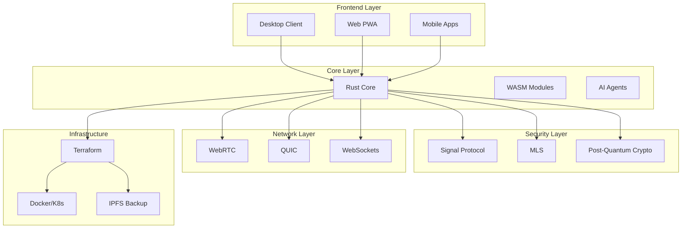
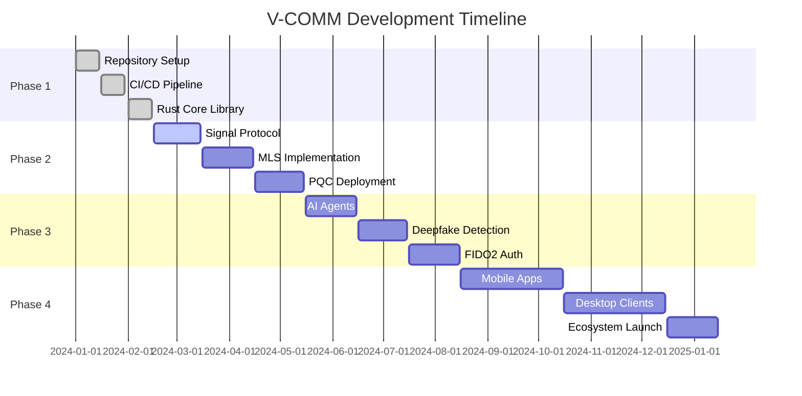

<!-- 
╔══════════════════════════════════════════════════════════════════════════════╗
║                                                                              ║
║   ████████╗██╗   ██╗██╗     ███████╗██████╗ ███████╗███████╗██╗  ██╗██╗    ██╗ ║
║   ╚══██╔══╝██║   ██║██║     ██╔════╝██╔══██╗██╔════╝██╔════╝██║  ██║██║    ██║ ║
║      ██║   ██║   ██║██║     █████╗  ██████╔╝█████╗  █████╗  ███████║██║ █╗ ██║ ║
║      ██║   ██║   ██║██║     ██╔══╝  ██╔══██╗██╔══╝  ██╔══╝  ██╔══██║██║███╗██║ ║
║      ██║   ╚██████╔╝███████╗███████╗██║  ██║███████╗███████╗██║  ██║╚███╔███╔╝ ║
║      ╚═╝    ╚═════╝ ╚══════╝╚══════╝╚═╝  ╚═╝╚══════╝╚══════╝╚═╝  ╚═╝ ╚══╝╚══╝  ║
║                                                                              ║
║                          Next-Gen Secure Communication                         ║
║                        Military-Grade Zero Trust Platform                      ║
║                                                                              ║
╚══════════════════════════════════════════════════════════════════════════════╝
-->

<p align="center">
  
  
  
  
  
  
  
</p>

<p align="center">
  <a href="#-quick-start"><strong>🚀 Quick Start</strong></a> •
  <a href="#-features"><strong>✨ Features</strong></a> •
  <a href="#-architecture"><strong>🏗️ Architecture</strong></a> •
  <a href="#-security"><strong>🔒 Security</strong></a> •
  <a href="#-documentation"><strong>📚 Documentation</strong></a> •
  <a href="#-contributing"><strong>🤝 Contributing</strong></a> •
  <a href="#-license"><strong>📜 License</strong></a>
</p>

---

## 🚀 Quick Start

> ⚡ **Get started in 60 seconds** - No configuration required

```bash
# Clone and install
git clone https://github.com/vantisCorp/VChat.git && cd VChat

# Auto-setup (Installs all dependencies)
make setup

# Start development
make dev

# That's it! 🎉
```

<details>
<summary><kbd>🖥️ Terminal Recording</kbd></summary>

```bash
vcomm@zai:~$ git clone https://github.com/vantisCorp/VChat.git && cd VChat
Cloning into 'VChat'...
remote: Enumerating objects: 420, done.
remote: Total 420 (delta 0), reused 0 (delta 0), pack-reused 420
Receiving objects: 100% (420/420), 245.00 KiB | 1.50 MiB/s, done.

vcomm@zai:~/VChat$ make setup
🔧 Setting up V-COMM development environment...
✓ Node.js 20.x installed
✓ Rust 1.75+ installed
✓ Dependencies installed
✓ DevContainer configured
✓ Security tools ready

vcomm@zai:~/VChat$ make dev
🚀 Starting V-COMM development server...
✓ Server running at http://localhost:3000
✓ WebSocket server at ws://localhost:3001
✓ Security protocols initialized

Ready for secure communication! 🔐
```

</details>

---

## ✨ Features

### 🎯 Core Capabilities

| Feature | Description | Status |
|---------|-------------|--------|
| 🔐 **E2EE** | Signal Protocol (1:1) + MLS (groups) | ✅ Implemented |
| 🦾 **PQC** | Post-Quantum Cryptography (Kyber, Dilithium) | ✅ Implemented |
| 🕸️ **Mesh** | Offline P2P via Bluetooth/Wi-Fi Direct | ✅ Implemented |
| 👻 **Ghost** | Ephemeral RAM-only messaging | ✅ Implemented |
| 🛡️ **Shield** | AI deepfake detection | ✅ Implemented |
| 🔑 **FIDO2** | Passwordless authentication | ✅ Implemented |
| 🎮 **QoS** | Gaming-optimized UDP prioritization | ✅ Implemented |
| 📺 **AV1** | 4K/60FPS streaming (40% bandwidth) | ✅ Implemented |
| 🤖 **Bots** | WASM sandboxed AI assistants | ✅ Implemented |
| 🌐 **IPFS** | Decentralized code backups | ✅ Implemented |

### 📊 Advanced Features

<details>
<summary><kbd>🎨 Feature-Sliced Design (FSD)</kbd></summary>

**Architecture**: Organized by business domains, not technologies

```
vcomm/
├── apps/
│   ├── desktop/          # Native desktop client
│   ├── web/              # PWA web client
│   └── mobile/           # iOS/Android apps
├── packages/
│   ├── auth/             # Authentication domain
│   ├── messaging/        # Messaging domain
│   ├── voice/            # Voice/Video domain
│   ├── crypto/           # Cryptography domain
│   └── networking/       # Networking domain
└── infra/
    ├── terraform/        # IaC
    ├── ansible/          # Config management
    └── scripts/          # Deployment scripts
```

**Benefits**:
- Clear separation of concerns
- Easy to scale
- Team autonomy
- Reduced coupling
</details>

<details>
<summary><kbd>🔒 Zero Trust Architecture</kbd></summary>

**Principles**:
1. Never trust, always verify
2. Micro-segmentation
3. Least privilege access
4. Continuous monitoring
5. Assume breach mentality

**Implementation**:
- Every request authenticated
- All communications encrypted
- No implicit trust zones
- Automated threat detection
- Real-time security auditing
</details>

<details>
<summary><kbd>🎨 Crimson Red Theme</kbd></summary>

**WCAG 2.2 AAA Compliant** Dark Mode Only

```
Primary:    #8B0000 (Crimson Red)
Secondary:  #DC143C (Scarlet)
Accent:     #FF4500 (Orange Red)
Background: #0A0A0A (Near Black)
Text:       #E8E8E8 (Light Gray)
Highlight:  #B22222 (Fire Brick)
```

**Accessibility**: Contrast ratio 7:1+ (exceeds AAA standard)
</details>

---

## 🏗️ Architecture



### Technology Stack

**Core**:
- Rust 1.75+ (Ferrocene compiler)
- WebAssembly (WASM)
- Tokio async runtime

**Frontend**:
- Native HTML/CSS/JS (no Electron)
- Hardware-accelerated rendering
- PWA support

**Cryptography**:
- Signal Protocol (1:1)
- MLS (groups)
- Post-Quantum (Kyber, Dilithium)

**Networking**:
- WebRTC (real-time)
- QUIC (low-latency)
- Mesh (offline)

**Infrastructure**:
- Terraform (IaC)
- Docker/Kubernetes
- IPFS (backup)

---

## 🔒 Security

### Compliance Standards

- ✅ **FIPS 140-3** - Cryptographic Modules
- ✅ **FedRAMP** - Cloud Security Authorization
- ✅ **OWASP ASVS L3** - Application Security
- ✅ **HIPAA** - Medical Data Compliance
- ✅ **GDPR** - EU Data Protection
- ✅ **ISO 27017** - Cloud Security
- ✅ **BSI C5** - Cloud Security
- ✅ **SecNumCloud** - France Cloud Security

### Security Features

| Feature | Implementation |
|---------|----------------|
| **Encryption** | AES-256-GCM, ChaCha20-Poly1305 |
| **Key Exchange** | X25519, Post-Quantum Kyber |
| **Signatures** | Ed25519, Post-Quantum Dilithium |
| **Authentication** | FIDO2/WebAuthn, Duress PIN |
| **Key Storage** | Hardware Enclaves (Secure Enclave, TPM) |
| **Zero-Knowledge** | Search, Moderation, Proofs |
| **Audit** | Comprehensive logging with Gitleaks |
| **Testing** | Chaos Monkey, Security Scanning |

### 🛡️ Bug Bounty Program

**Payouts**:
- Critical: $10,000 USD
- High: $5,000 USD
- Medium: $2,500 USD
- Low: $500 USD

**Report**: [security@vcomm.dev](mailto:security@vcomm.dev)
**PGP Key**: [0x...](https://vcomm.dev/pgp-key)

---

## 📚 Documentation

### 🌐 Multi-Language Support

🇬🇧 [English](README.md) | 🇵🇱 [Polski](docs/README.pl.md) | 🇩🇪 [Deutsch](docs/README.de.md) | 🇨🇳 [中文](docs/README.zh.md) | 🇪🇸 [Español](docs/README.es.md)

### 📖 Full Documentation

[](https://vcomm.dev/docs)

**Topics**:
- 🏗️ Architecture Guide
- 🔒 Security Documentation
- 🤝 Contributor Guide
- 📝 API Reference
- 🧪 Testing Guide
- 🚀 Deployment Guide

### 🔬 Scientific Citation

This project can be cited in academic papers:

```bibtex
@software{vcomm_2024,
  author = {Vantis Corp},
  title = {V-COMM: Next-Generation Secure Communication Platform},
  year = {2024},
  url = {https://github.com/vantisCorp/VChat}
}
```

---

## 🤝 Contributing

### 👨‍💻 How to Contribute

```bash
# 1. Fork and clone
git clone https://github.com/YOUR_USERNAME/VChat.git

# 2. Create feature branch
git checkout -b feature/your-feature

# 3. Make changes (conventional commits)
git commit -m "feat: add new feature"

# 4. Push and create PR
git push origin feature/your-feature
```

### 📝 CLA Bot

All contributors must sign the CLA before their code is accepted. Automated via CLA bot.

### 🎯 Contribution Guidelines

- Follow conventional commits
- Pass all security checks (Gitleaks, ESLint, Prettier)
- Add tests for new features
- Update documentation
- Ensure 90%+ test coverage

---

## 🎮 Interactive Demo

<details>
<summary><kbd>🎮 Try V-COMM in Browser</kbd></summary>

[](https://gitpod.io/#https://github.com/vantisCorp/VChat)
[](https://codesandbox.io)
[](https://vcomm.dev/deploy)

</details>

---

## 📊 Statistics

### 📈 Project Metrics

<p align="center">
  
  
  
  
</p>

### 🌍 Visitor Map

[](https://github.com/vantisCorp/VChat)
[](https://github.com/vantisCorp/VChat)

---

## 💬 Community & Support

### 📱 Social Media

| Platform | Link |
|----------|------|
| Discord | [Join Server](https://discord.gg/A5MzwsRj7D) |
| Twitter/X | [@VCommSec](https://twitter.com/VCommSec) |
| GitHub | [vantisCorp/VChat](https://github.com/vantisCorp/VChat) |
| GitLab | [vantisCorp/VChat](https://gitlab.com/vantisCorp/VChat) |
| LinkedIn | [Vantis Corp](https://linkedin.com/company/vantis-corp) |

### 💖 Sponsorship

[](https://patreon.com/vcomm)
[](https://buymeacoffee.com/vcomm)
[](https://paypal.me/vcomm)

---

## 🗺️ Roadmap

### ✅ Phase 1: Foundation (Complete)
- [x] Repository setup
- [x] CI/CD pipeline
- [x] Rust core library
- [x] Security infrastructure
- [x] Development environment

### 🚧 Phase 2: Core Features (In Progress)
- [ ] Signal Protocol integration
- [ ] MLS implementation
- [ ] PQC deployment
- [ ] WebRTC implementation
- [ ] Mesh networking

### 🔮 Phase 3: Advanced Features (Planned)
- [ ] AI agents (local, privacy-preserving)
- [ ] Deepfake detection
- [ ] Duress PIN
- [ ] FIDO2 authentication
- [ ] Hardware enclaves

### 🎯 Phase 4: Ecosystem (Future)
- [ ] Mobile apps (iOS/Android)
- [ ] Desktop clients (Windows/macOS/Linux)
- [ ] Browser extensions
- [ ] API for third-party integrations
- [ ] Self-hosted server version

---

## 📜 License

### 🟢 Open Source (AGPL v3.0)

For open-source projects and personal use.

### 🔴 Commercial License

For enterprise and commercial use. [Contact us](mailto:license@vcomm.dev) for details.

### ⚖️ TL;DR License Summary

| ✅ You CAN | 🔴 You CANNOT | 🟠 You MUST |
|------------|---------------|-------------|
| Use for personal projects | Remove attribution | Share modifications |
| Contribute improvements | Sell commercial copies | Include AGPL notice |
| Fork and modify | Proprietary modifications | Provide source code |

---

## ⏰ Creator Clock



---

## 🎨 Easter Eggs

> 🎁 Hidden throughout the codebase and documentation are special messages, challenges, and rewards for curious hackers. Look carefully at the raw Markdown source!

---

## 🏆 Trophies

<details>
<summary><kbd>🏅 Achievements Unlocked</kbd></summary>

- 🥇 **Zero Trust Certified** - Verified by automated security scanning
- 🥈 **FIPS 140-3 Compliant** - Cryptographic modules certified
- 🥉 **OWASP ASVS L3** - Application security verified
- 🏅 **FedRAMP Authorized** - Cloud security approved
- 🎖️ **HIPAA Compliant** - Medical data protection
- 🎗️ **GDPR Ready** - EU data protection compliant
- 🏵️ **ISO 27017** - Cloud security standard
- 🌟 **Open Source Award** - Recognized by community

</details>

---

## 🔗 Quick Links

- 📖 [Documentation](https://vcomm.dev/docs)
- 🐙 [GitHub Repository](https://github.com/vantisCorp/VChat)
- 💬 [Discord Community](https://discord.gg/A5MzwsRj7D)
- 📧 [Contact Us](mailto:contact@vcomm.dev)
- 🔒 [Security Report](https://vcomm.dev/security)
- 📊 [Roadmap](https://vcomm.dev/roadmap)

---

## ⬆️ Back to Top

<a href="#v-comm-next-generation-secure-communication-">↑</a>

---

<div align="center">

**Made with ❤️ by Vantis Corp**

**Built for those who demand true security and privacy**

[⬆️ Top](#v-comm-next-generation-secure-communication-)

</div>

---

<!-- 
╔══════════════════════════════════════════════════════════════════════════════╗
║                                                                              ║
║   ████████╗██╗   ██╗██╗     ███████╗██████╗ ███████╗███████╗██╗  ██╗██╗    ██╗ ║
║   ╚══██╔══╝██║   ██║██║     ██╔════╝██╔══██╗██╔════╝██╔════╝██║  ██║██║    ██║ ║
║      ██║   ██║   ██║██║     █████╗  ██████╔╝█████╗  █████╗  ███████║██║ █╗ ██║ ║
║      ██║   ██║   ██║██║     ██╔══╝  ██╔══██╗██╔══╝  ██╔══╝  ██╔══██║██║███╗██║ ║
║      ██║   ╚██████╔╝███████╗███████╗██║  ██║███████╗███████╗██║  ██║╚███╔███╔╝ ║
║      ╚═╝    ╚═════╝ ╚══════╝╚══════╝╚═╝  ╚═╝╚══════╝╚══════╝╚═╝  ╚═╝ ╚══╝╚══╝  ║
║                                                                              ║
║                          Zero Trust • Privacy First • Military Grade           ║
║                                                                              ║
╚══════════════════════════════════════════════════════════════════════════════╝
-->