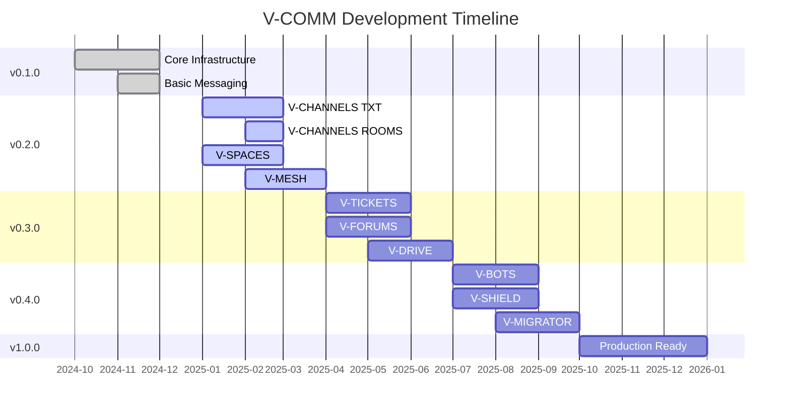

# V-COMM Roadmap

This document outlines the planned development path for V-COMM.

## 🎯 Vision

V-COMM aims to become the world's most secure, privacy-focused communication platform while maintaining excellent usability and performance.

## 📅 Release Schedule

| Version | Target Date | Status | Major Features |
|---------|-------------|--------|----------------|
| 0.1.0 | Q1 2025 | ✅ Released | Core infrastructure, basic messaging |
| 0.2.0 | Q2 2025 | 🚧 In Progress | V-CHANNELS, V-SPACES, V-MESH |
| 0.3.0 | Q3 2025 | 📅 Planned | V-TICKETS, V-FORUMS, V-DRIVE |
| 0.4.0 | Q4 2025 | 📅 Planned | V-BOTS, V-SHIELD, V-MIGRATOR |
| 1.0.0 | Q1 2026 | 📅 Planned | Full feature set, production ready |

## 🚧 Current Release: v0.2.0

**Status**: In Development  
**Target**: Q2 2025

### Features in Progress

#### V-CHANNELS
- [x] TXT channels (basic text messaging)
- [ ] ROOMS (voice/video rooms)
- [ ] FEEDBACK channels
- [ ] Channel moderation tools
- [ ] Channel permissions
- [ ] Channel templates

#### V-SPACES
- [ ] Space creation and management
- [ ] Member roles and permissions
- [ ] Space discovery
- [ ] Space invitations
- [ ] Space analytics

#### V-MESH
- [x] Basic mesh networking
- [ ] Store-and-forward messaging
- [ ] Automatic route discovery
- [ ] Offline indicator
- [ ] Mesh-only mode
- [ ] Range extension

### Bug Fixes & Improvements
- [ ] Improve WebSocket stability
- [ ] Optimize message encryption
- [ ] Reduce memory usage
- [ ] Improve error handling
- [ ] Better logging

## 📅 Upcoming Release: v0.3.0

**Target**: Q3 2025

### Planned Features

#### V-TICKETS (Whistleblower System)
- [ ] Anonymous ticket creation
- [ ] Secure file attachments
- [ ] End-to-end encryption
- [ ] Duress mode integration
- [ ] Ticket lifecycle management
- [ ] Notification system
- [ ] Evidence protection

#### V-FORUMS
- [ ] Discussion forums
- [ ] Cryptographic validation
- [ ] Reputation system
- [ ] Voting mechanisms
- [ ] Moderation tools
- [ ] Thread management

#### V-DRIVE (P2P Storage)
- [ ] File encryption and upload
- [ ] IPFS integration
- [ ] Peer discovery
- [ ] File sharing
- [ ] Storage quotas
- [ ] File versioning
- [ ] Access controls

### Technical Improvements
- [ ] Performance optimizations
- [ ] Database query optimization
- [ ] Caching improvements
- [ ] Better error messages

## 📅 Future Release: v0.4.0

**Target**: Q4 2025

### Planned Features

#### V-BOTS (AI Agents)
- [ ] Bot SDK
- [ ] WASM sandbox
- [ ] Bot marketplace
- [ ] Bot permissions
- [ ] Bot analytics
- [ ] Custom bot templates

#### V-SHIELD (Anti-Deepfake)
- [ ] Media analysis
- [ ] Deepfake detection
- [ ] Biometric verification
- [ ] Blockchain verification
- [ ] User trust scores
- [ ] Reporting system

#### V-MIGRATOR
- [ ] Discord migration
- [ ] Slack migration
- [ ] Telegram migration
- [ ] Data validation
- [ ] Encryption preservation
- [ ] Bulk migration tools

### Additional Features
- [ ] Tactical whiteboards
- [ ] Screen sharing improvements
- [ ] Voice transcription
- [ ] Custom emojis
- [ ] Rich presence
- [ ] User status messages

## 🎯 Long-term Goals (v1.0.0 and beyond)

### Q1 2026: v1.0.0 Release

**Production-Ready Features**:
- All v0.x features stable
- Comprehensive documentation
- SLA guarantees
- 24/7 monitoring
- Disaster recovery procedures
- Enterprise integrations
- White-label options

### Post-1.0.0 Plans

#### Enhanced Features
- [ ] Multi-device synchronization
- [ ] Message search
- [ ] Scheduled messages
- [ ] Message reactions
- [ ] Pinned messages
- [ ] Message threads
- [ ] Mentions and notifications

#### Platform Improvements
- [ ] Mobile apps (iOS, Android)
- [ ] Desktop apps (Windows, macOS, Linux)
- [ ] Progressive Web App (PWA)
- [ ] Browser extensions
- [ ] CLI tools

#### Integrations
- [ ] V-IDENTITY (Steam, PSN, GitHub, etc.)
- [ ] V-ECONOMY (payment gateway)
- [ ] V-ANNOUNCE (cross-guild announcements)
- [ ] Calendar integration
- [ ] Task management
- [ ] CRM integration

#### Advanced Features
- [ ] Real-time collaboration
- [ ] Video conferencing (100+ participants)
- [ ] Webinars
- [ ] Live streaming
- [ ] Podcast hosting
- [ ] E-learning platform

#### Enterprise Features
- [ ] SSO/SAML integration
- [ ] Audit logs
- [ ] Data export tools
- [ ] Custom branding
- [ ] SLA monitoring
- [ ] Dedicated support
- [ ] On-premise deployment

## 🔮 Future Concepts

These are exploratory features we're researching:

### Quantum Networking
- Quantum key distribution (QKD)
- Quantum-resistant mesh networking
- Entanglement-based communication

### AI Integration
- AI-powered moderation
- Sentiment analysis
- Automatic summarization
- Translation services
- Smart replies

### Extended Reality
- VR meetings
- AR collaboration
- Virtual workspaces
- 3D models sharing

### Decentralized
- DAO governance
- Token-based economics
- Decentralized identity
- Blockchain verification
- IPFS-based infrastructure

## 📊 Technical Debt

We're actively working on reducing technical debt:

### Backend
- [ ] Refactor legacy code
- [ ] Improve error handling
- [ ] Add comprehensive tests
- [ ] Optimize database queries
- [ ] Improve API documentation

### Frontend
- [ ] Reduce bundle size
- [ ] Improve performance
- [ ] Better accessibility (WCAG 2.1)
- [ ] Improve mobile experience
- [ ] Better state management

### Infrastructure
- [ ] Improve CI/CD pipeline
- [ ] Better monitoring and alerting
- [ ] Automated security scanning
- [ ] Disaster recovery testing
- [ ] Load testing

## 🤝 Community Contributions

We welcome community contributions! See the [Contributing Guide](Contributing-Guide.md) for details.

### Wanted Features
- Mobile apps (high priority)
- Desktop apps (high priority)
- Browser extensions
- Additional language support
- UI/UX improvements
- Performance optimizations

### How to Help
- Report bugs
- Suggest features
- Submit pull requests
- Write documentation
- Translate content
- Help other users

## 📈 Metrics & Goals

### User Growth Targets
- Q2 2025: 1,000 active users
- Q3 2025: 5,000 active users
- Q4 2025: 10,000 active users
- Q1 2026: 50,000 active users

### Performance Goals
- Message latency: < 100ms
- Video call quality: 4K @ 60fps
- File upload: 100+ MB/s
- API response: < 50ms
- Uptime: 99.99%

### Security Goals
- Zero critical vulnerabilities
- < 24h vulnerability response
- Regular security audits
- Bug bounty program expansion
- SOC 2 Type II certification

## 🗓️ Timeline Visualization

## 🔄 Feature Request Process

We prioritize features based on:

1. **User demand**: Most requested features get priority
2. **Security impact**: Security improvements are prioritized
3. **Technical feasibility**: Must be achievable with our resources
4. **Strategic value**: Aligns with V-COMM's vision
5. **Community contributions**: Features with contributors move faster

### Request a Feature

Use our [Feature Request Template](../.github/ISSUE_TEMPLATE/FEATURE_REQUEST.yml) to suggest new features.

---

This roadmap is subject to change based on user feedback, technical challenges, and strategic priorities.

**Last Updated**: March 2025  
**Next Review**: April 2025