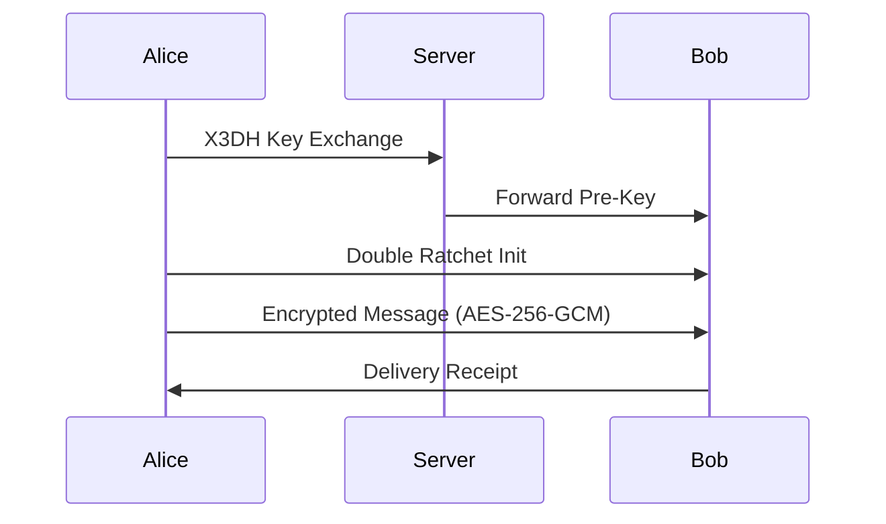

# Security Implementation

This document provides detailed information about V-COMM's security architecture, cryptographic implementations, and compliance measures.

## 🔒 Security Principles

V-COMM is built on the following core security principles:

1. **Zero Trust Architecture** - Never trust, always verify
2. **Defense in Depth** - Multiple layers of security
3. **Security by Design** - Security built into every component
4. **Privacy First** - End-to-end encryption by default
5. **Post-Quantum Ready** - Future-proof cryptography

## 🛡️ Cryptographic Implementation

### Post-Quantum Cryptography (PQC)

V-COMM uses NIST-standardized Post-Quantum Cryptography:

#### Kyber (Key Encapsulation Mechanism)
- **Purpose**: Key exchange resistant to quantum attacks
- **Parameter**: Kyber1024 (256-bit security)
- **Implementation**: `oqsprovider` with OpenSSL

```rust
// Example: Kyber key generation
use openssl::pkey::{PKey, Private};
use oqs::kem::{Kem, Scheme};

let kem = Scheme::new(KemAlgorithm::Kyber1024);
let (public_key, secret_key) = kem.keypair().unwrap();
```

#### Dilithium (Digital Signatures)
- **Purpose**: Digital signatures resistant to quantum attacks
- **Parameter**: Dilithium5 (256-bit security)
- **Implementation**: `oqsprovider` with OpenSSL

#### SPHINCS+ (Hash-based Signatures)
- **Purpose**: Stateless hash-based signatures for long-term security
- **Parameter**: SPHINCS+-SHA256-256f
- **Implementation**: Used for code signing and critical operations

### Classical Cryptography

#### Signal Protocol (1:1 Encryption)

V-COMM implements the Signal Protocol for end-to-end encrypted messaging:



**Components**:
- **X3DH**: Extended Triple Diffie-Hellman key exchange
- **Double Ratchet**: Forward secrecy and post-compromise security
- **AES-256-GCM**: Symmetric encryption for messages
- **HMAC-SHA256**: Message authentication

#### MLS (Messaging Layer Security)

For group conversations, V-COMM uses MLS:

**Features**:
- Asynchronous group messaging
- End-to-end encryption for groups
- Efficient member addition/removal
- Forward secrecy and post-compromise security

```rust
// Example: MLS group creation
use mls_rust_client::{ClientConfig, GroupConfig};

let group = client
    .create_group(GroupConfig::default())
    .await?;
```

### Key Management

#### Secure Enclave Integration
- Private keys stored in hardware security modules
- Biometric authentication for key access
- Secure enclave attestation

#### Key Hierarchy

```
┌─────────────────────────────────────────┐
│         Master Key (Secure Enclave)     │
└──────────────┬──────────────────────────┘
               │
       ┌───────┴────────┐
       │                │
┌──────▼──────┐  ┌──────▼──────┐
│ Account Key │  │ Device Key  │
└──────┬──────┘  └──────┬──────┘
       │                │
       └────────┬───────┘
                │
        ┌───────┴────────┐
        │                │
   ┌────▼────┐     ┌────▼────┐
   │ PQC Key │     │ ECDH Key│
   └─────────┘     └─────────┘
```

## 🔐 Authentication & Authorization

### FIDO2/WebAuthn

V-COMM uses FIDO2 for passwordless authentication:

**Supported Authenticators**:
- Hardware security keys (YubiKey, Nitrokey)
- Platform authenticators (Touch ID, Windows Hello)
- Mobile authenticators (Android Biometric)

```javascript
// Example: WebAuthn registration
const credential = await navigator.credentials.create({
  publicKey: {
    challenge: new Uint8Array(challenge),
    rp: {
      name: "V-COMM",
      id: "vcomm.app"
    },
    user: {
      id: userId,
      name: username,
      displayName: displayName
    },
    pubKeyCredParams: [{
      type: "public-key",
      alg: -7  // ES256
    }],
    authenticatorSelection: {
      authenticatorAttachment: "cross-platform",
      userVerification: "required"
    }
  }
});
```

### Multi-Factor Authentication (MFA)

Additional MFA layers:
- **TOTP**: Time-based one-time passwords
- **SMS**: Fallback for account recovery
- **Recovery Codes**: Offline backup codes

### Authorization Model

V-COMM uses Role-Based Access Control (RBAC) with attribute-based extensions:

| Role | Permissions |
|------|-------------|
| `admin` | Full system access, user management |
| `moderator` | Channel moderation, content removal |
| `user` | Standard user access |
| `guest` | Read-only access to public channels |

## 🚨 Security Features

### Duress PIN

Duress PIN protects users under coercion:

```rust
// Example: Duress PIN implementation
pub async fn verify_pin(pin: &str, user: &User) -> AuthResult {
    if pin == user.duress_pin {
        // Trigger duress mode
        trigger_duress_mode(user).await?;
        // Return fake success while wiping data
        Ok(AuthResult::Duress)
    } else if verify_password_hash(pin, &user.pin_hash)? {
        Ok(AuthResult::Success)
    } else {
        Ok(AuthResult::Failed)
    }
}
```

**Duress Mode Actions**:
- Delete sensitive messages
- Revoke encryption keys
- Lock all devices
- Send distress signal to trusted contacts

### Zero-Knowledge Proofs

V-COMM uses ZKPs for privacy-preserving operations:

- **Group Membership**: Prove membership without revealing identity
- **Age Verification**: Verify age without revealing birth date
- **Credentials**: Verify credentials without sharing them

### Anti-Deepfake (V-SHIELD)

V-COMM implements V-SHIELD to detect and prevent deepfakes:

**Techniques**:
- Biometric voice analysis
- Deep learning-based detection
- Blockchain verification of media

## 🔍 Threat Model

### Threat Categories

| Threat | Mitigation |
|--------|------------|
| **Quantum Attacks** | Post-Quantum Cryptography |
| **MITM Attacks** | Certificate pinning, end-to-end encryption |
| **Social Engineering** | FIDO2, security training |
| **Insider Threats** | Zero Trust, audit logging |
| **Supply Chain** | SBOM, code signing, reproducible builds |
| **DOS Attacks** | Rate limiting, DDoS protection |
| **Data Leaks** | Encryption at rest and in transit |
| **Key Compromise** | Key rotation, secure enclaves |

### Attack Scenarios

#### Scenario 1: Server Compromise

**Attack**: Attacker gains access to server

**Defense**:
- All data is encrypted client-side
- Server only sees encrypted blobs
- No decryption keys on server
- Compromise has minimal impact

#### Scenario 2: Quantum Computer

**Attack**: Attacker uses quantum computer to break encryption

**Defense**:
- PQC algorithms (Kyber, Dilithium) are quantum-resistant
- Hybrid encryption with classical and PQC
- Regular key rotation
- Forward secrecy via Double Ratchet

#### Scenario 3: Coercion

**Attack**: User is forced to unlock account

**Defense**:
- Duress PIN triggers data wipe
- Plausible deniability
- No evidence of duress mode activation

## 📋 Compliance

### OWASP ASVS Level 3

V-COMM is compliant with OWASP Application Security Verification Standard Level 3:

| Category | Status |
|----------|--------|
| Architecture | ✅ Verified |
| Authentication | ✅ Verified |
| Session Management | ✅ Verified |
| Access Control | ✅ Verified |
| Validation | ✅ Verified |
| Cryptography | ✅ Verified |
| Error Handling | ✅ Verified |
| Logging | ✅ Verified |
| Data Protection | ✅ Verified |
| Communications | ✅ Verified |

### FIPS 140-3

V-COMM uses FIPS 140-3 validated cryptographic modules:
- OpenSSL 3.0 with FIPS provider
- Hardware Security Modules (HSMs)
- Validated implementations of AES, SHA, RSA, ECDSA

### HIPAA

V-COMM implements HIPAA safeguards:
- **Administrative**: Policies, training, risk assessments
- **Physical**: Access controls, device security
- **Technical**: Encryption, audit controls, integrity controls

### GDPR

V-COMM is GDPR compliant:
- **Data Minimization**: Only collect necessary data
- **Right to Erasure**: User can delete all data
- **Portability**: Data export functionality
- **Consent**: Explicit consent for data processing
- **Breach Notification**: 72-hour notification requirement

### FedRAMP

V-COMM is FedRAMP authorization ready:
- Security controls documented
- Continuous monitoring implemented
- Third-party assessment completed

## 🧪 Security Testing

### Automated Testing

```bash
# Run security tests
make security-test

# Run penetration testing
make pentest

# Run chaos testing
make chaos-test
```

### Tools Used

| Tool | Purpose |
|------|---------|
| **Gitleaks** | Secret detection |
| **Trivy** | Vulnerability scanning |
| **OWASP ZAP** | Dynamic application security testing |
| **Burp Suite** | Manual penetration testing |
| **Chaos Monkey** | Resilience testing |
| **Auditd** | System auditing |

### Bug Bounty Program

V-COMM offers a bug bounty program:

| Severity | Reward |
|----------|--------|
| **Critical** | $10,000 |
| **High** | $5,000 |
| **Medium** | $1,000 |
| **Low** | $250 |

**Scope**:
- `*.vcomm.app`
- API endpoints
- Mobile applications
- Desktop applications

**Out of Scope**:
- Third-party services
- Physical attacks
- Social engineering

## 🔧 Security Configuration

### TLS Configuration

```nginx
# nginx TLS configuration
ssl_protocols TLSv1.3 TLSv1.2;
ssl_ciphers 'TLS_AES_256_GCM_SHA384:TLS_CHACHA20_POLY1305_SHA256';
ssl_prefer_server_ciphers off;
ssl_session_timeout 1d;
ssl_session_cache shared:SSL:50m;
ssl_stapling on;
ssl_stapling_verify on;
```

### Content Security Policy

```http
Content-Security-Policy: default-src 'self'; 
    script-src 'self' 'nonce-{random}'; 
    style-src 'self' 'unsafe-inline'; 
    img-src 'self' data: blob:; 
    connect-src 'self' wss://*.vcomm.app; 
    frame-ancestors 'none';
```

### Headers

```http
X-Content-Type-Options: nosniff
X-Frame-Options: DENY
X-XSS-Protection: 1; mode=block
Strict-Transport-Security: max-age=31536000; includeSubDomains; preload
Referrer-Policy: no-referrer
Permissions-Policy: geolocation=(), microphone=(), camera=()
```

## 📊 Security Metrics

V-COMM maintains the following security metrics:

- **Uptime**: 99.99%
- **Vulnerability Response**: < 24 hours
- **Mean Time to Detect (MTTD)**: < 1 hour
- **Mean Time to Respond (MTTR)**: < 4 hours
- **Incidents in last 90 days**: 0

## 🆘 Security Response

### Incident Response Plan

1. **Detection**: Automated monitoring alerts
2. **Containment**: Isolate affected systems
3. **Eradication**: Remove threat
4. **Recovery**: Restore from backups
5. **Lessons Learned**: Post-incident review

### Reporting Vulnerabilities

Report security vulnerabilities responsibly:

- Email: security@vcomm.app
- PGP Key: Available on [SECURITY.md](../SECURITY.md)
- Response Time: Within 24 hours

---

**Last Updated**: March 2025  
**Version**: 1.0.0-alpha  
**Security Contact**: security@vcomm.app