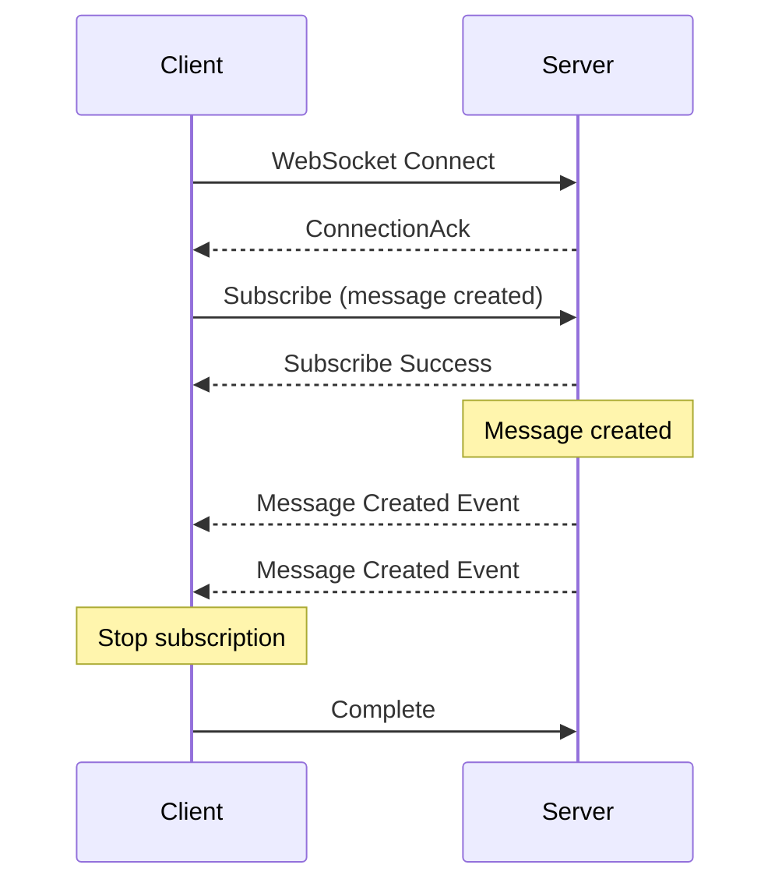

# GraphQL Subscriptions

GraphQL subscriptions provide real-time updates by maintaining a persistent WebSocket connection and pushing events as they occur.

## Overview

**WebSocket Endpoint**: `wss://api.vcomm.io/graphql`

**Connection Protocol**: `graphql-transport-ws`



---

## Connection Setup

### Establish Connection

```javascript
const ws = new WebSocket('wss://api.vcomm.io/graphql', 'graphql-transport-ws');

ws.onopen = () => {
  // Initialize connection
  ws.send(JSON.stringify({ type: 'connection_init', payload: {} }));
};
```

### Authentication

Include access token in connection init:

```javascript
ws.send(JSON.stringify({
  type: 'connection_init',
  payload: {
    Authorization: 'Bearer your_access_token'
  }
}));
```

---

## Message Subscriptions

### Subscribe to New Messages

Receive new messages in a channel in real-time.

```graphql
subscription OnMessageCreated($channelId: ID!) {
  messageCreated(channelId: $channelId) {
    id
    content
    author {
      id
      username
      displayName
      avatar
    }
    channel {
      id
      name
      space {
        id
        name
      }
    }
    timestamp
    editedTimestamp
    attachments {
      id
      filename
      url
      size
      contentType
    }
    embeds {
      title
      description
      color
      fields {
        name
        value
        inline
      }
    }
    reactions {
      emoji
      count
      me
    }
    type
    webhookId
  }
}
```

**Variables**:
```json
{
  "channelId": "ch_abc123"
}
```

### Subscribe to Message Updates

```graphql
subscription OnMessageUpdated($channelId: ID!) {
  messageUpdated(channelId: $channelId) {
    id
    content
    editedTimestamp
    channel {
      id
      name
    }
  }
}
```

### Subscribe to Message Deletions

```graphql
subscription OnMessageDeleted($channelId: ID!) {
  messageDeleted(channelId: $channelId) {
    id
    channelId
    deletedAt
  }
}
```

---

## Channel Subscriptions

### Subscribe to Channel Events

```graphql
subscription OnChannelUpdated($spaceId: ID!) {
  channelUpdated(spaceId: $spaceId) {
    id
    name
    type
    description
    topic
    position
    space {
      id
      name
    }
    updatedAt
  }
}
```

### Subscribe to Channel Creation

```graphql
subscription OnChannelCreated($spaceId: ID!) {
  channelCreated(spaceId: $spaceId) {
    id
    name
    type
    description
    position
    createdAt
  }
}
```

### Subscribe to Channel Deletion

```graphql
subscription OnChannelDeleted($spaceId: ID!) {
  channelDeleted(spaceId: $spaceId) {
    id
    name
    spaceId
    deletedAt
  }
}
```

---

## Presence Subscriptions

### Subscribe to Presence Updates

```graphql
subscription OnPresenceUpdated($spaceIds: [ID!]!) {
  presenceUpdated(spaceIds: $spaceIds) {
    user {
      id
      username
      displayName
      avatar
    }
    spaceId
    status
    activities {
      name
      type
      state
      url
    }
    clientStatus {
      desktop
      mobile
      web
    }
    lastModified
  }
}
```

**Variables**:
```json
{
  "spaceIds": ["sp_abc123", "sp_xyz789"]
}
```

### Subscribe to Typing Indicators

```graphql
subscription OnTyping($channelId: ID!) {
  typing(channelId: $channelId) {
    userId
    channelId
    timestamp
    user {
      id
      username
      displayName
    }
  }
}
```

---

## Reaction Subscriptions

### Subscribe to Reaction Events

```graphql
subscription OnReactionAdded($channelId: ID!) {
  reactionAdded(channelId: $channelId) {
    messageId
    userId
    emoji {
      id
      name
      animated
    }
    user {
      id
      username
      displayName
    }
    message {
      id
      content
      reactions {
        emoji
        count
        me
      }
    }
  }
}
```

### Subscribe to Reaction Removals

```graphql
subscription OnReactionRemoved($channelId: ID!) {
  reactionRemoved(channelId: $channelId) {
    messageId
    userId
    emoji {
      id
      name
    }
    message {
      id
      reactions {
        emoji
        count
        me
      }
    }
  }
}
```

---

## Member Subscriptions

### Subscribe to Member Joins

```graphql
subscription OnMemberAdded($spaceId: ID!) {
  memberAdded(spaceId: $spaceId) {
    user {
      id
      username
      displayName
      avatar
    }
    space {
      id
      name
    }
    nick
    roles {
      id
      name
      color
    }
    joinedAt
  }
}
```

### Subscribe to Member Updates

```graphql
subscription OnMemberUpdated($spaceId: ID!) {
  memberUpdated(spaceId: $spaceId) {
    user {
      id
      username
    }
    space {
      id
      name
    }
    nick
    roles {
      id
      name
    }
    updatedAt
  }
}
```

### Subscribe to Member Removals

```graphql
subscription OnMemberRemoved($spaceId: ID!) {
  memberRemoved(spaceId: $spaceId) {
    user {
      id
      username
    }
    space {
      id
      name
    }
    removedAt
  }
}
```

---

## Role Subscriptions

### Subscribe to Role Events

```graphql
subscription OnRoleCreated($spaceId: ID!) {
  roleCreated(spaceId: $spaceId) {
    id
    name
    color
    position
    permissions
    space {
      id
      name
    }
    createdAt
  }
}
```

### Subscribe to Role Updates

```graphql
subscription OnRoleUpdated($spaceId: ID!) {
  roleUpdated(spaceId: $spaceId) {
    id
    name
    color
    permissions
    space {
      id
      name
    }
    updatedAt
  }
}
```

### Subscribe to Role Deletions

```graphql
subscription OnRoleDeleted($spaceId: ID!) {
  roleDeleted(spaceId: $spaceId) {
    id
    name
    spaceId
    deletedAt
  }
}
```

---

## User Subscriptions

### Subscribe to User Updates

```graphql
subscription OnUserUpdated($userId: ID!) {
  userUpdated(userId: $userId) {
    id
    username
    displayName
    avatar
    banner
    bio
    status {
      text
      emoji
      expiresAt
    }
    updatedAt
  }
}
```

### Subscribe to Friend Requests

```graphql
subscription OnFriendRequest {
  friendRequest {
    id
    type
    user {
      id
      username
      displayName
      avatar
    }
    requestedAt
  }
}
```

---

## Notification Subscriptions

### Subscribe to Notifications

```graphql
subscription OnNotification {
  notification {
    id
    type
    title
    body
    read
    data
    createdAt
    actor {
      id
      username
      displayName
      avatar
    }
  }
}
```

### Subscribe to Unread Counts

```graphql
subscription OnUnreadCounts {
  unreadCounts {
    mentions
    directMessages
    notifications
    total
  }
}
```

---

## File Subscriptions

### Subscribe to File Events

```graphql
subscription OnFileUploaded($folderId: ID) {
  fileUploaded(folderId: $folderId) {
    id
    name
    size
    mimeType
    url
    folder {
      id
      name
    }
    uploadedBy {
      id
      username
    }
    createdAt
  }
}
```

### Subscribe to File Updates

```graphql
subscription OnFileUpdated($folderId: ID) {
  fileUpdated(folderId: $folderId) {
    id
    name
    size
    version {
      id
      version
      createdAt
    }
    updatedAt
  }
}
```

---

## Voice Subscriptions

### Subscribe to Voice State Updates

```graphql
subscription OnVoiceStateUpdated($spaceId: ID!) {
  voiceStateUpdated(spaceId: $spaceId) {
    userId
    space {
      id
      name
    }
    channel {
      id
      name
      type
    }
    sessionId
    deaf
    mute
    selfDeaf
    selfMute
    serverDeaf
    serverMute
    suppressed
  }
}
```

---

## SDK Examples

### JavaScript/TypeScript

```typescript
import { VCommClient, gql } from '@vcomm/sdk';

const client = new VCommClient({
  websocketUrl: 'wss://api.vcomm.io/graphql',
  accessToken: 'your-token'
});

// Subscribe to new messages
const subscription = client.subscribe({
  query: gql`
    subscription OnMessageCreated($channelId: ID!) {
      messageCreated(channelId: $channelId) {
        id
        content
        author {
          id
          username
          displayName
        }
        timestamp
      }
    }
  `,
  variables: {
    channelId: 'ch_abc123'
  }
});

// Handle incoming events
subscription.subscribe({
  next: (data) => {
    console.log('New message:', data.messageCreated);
  },
  error: (error) => {
    console.error('Subscription error:', error);
  },
  complete: () => {
    console.log('Subscription completed');
  }
});

// Unsubscribe later
subscription.unsubscribe();
```

### Python

```python
import asyncio
from vcomm import VCommClient
from gql import gql

async def message_subscription():
    client = VCommClient(
        websocket_url='wss://api.vcomm.io/graphql',
        access_token='your-token'
    )
    
    # Subscribe to new messages
    subscription = client.subscribe(
        gql('''
          subscription OnMessageCreated($channelId: ID!) {
            messageCreated(channelId: $channelId) {
              id
              content
              author {
                id
                username
                displayName
              }
              timestamp
            }
          }
        '''),
        variable_values={
            'channelId': 'ch_abc123'
        }
    )
    
    # Process incoming events
    async for event in subscription:
        message = event['messageCreated']
        print(f"New message from {message['author']['username']}: {message['content']}")

# Run subscription
asyncio.run(message_subscription())
```

---

## Subscription Lifecycle

```javascript
// 1. Connect
const ws = new WebSocket('wss://api.vcomm.io/graphql', 'graphql-transport-ws');

// 2. Initialize connection
ws.send(JSON.stringify({
  type: 'connection_init',
  payload: {
    Authorization: 'Bearer your_token'
  }
}));

// 3. Wait for connection_ack
ws.onmessage = (event) => {
  const data = JSON.parse(event.data);
  
  if (data.type === 'connection_ack') {
    console.log('Connected to GraphQL WebSocket');
    
    // 4. Start subscription
    ws.send(JSON.stringify({
      id: '1',
      type: 'subscribe',
      payload: {
        query: 'subscription { messageCreated { id content } }',
        variables: { channelId: 'ch_abc123' }
      }
    }));
  }
  
  // 5. Receive data
  if (data.type === 'next') {
    console.log('Received:', data.payload.data);
  }
  
  // 6. Handle completion
  if (data.type === 'complete') {
    console.log('Subscription completed');
  }
  
  // 7. Handle errors
  if (data.type === 'error') {
    console.error('Subscription error:', data.payload);
  }
};

// 8. Unsubscribe
function unsubscribe() {
  ws.send(JSON.stringify({
    id: '1',
    type: 'complete'
  }));
}
```

---

## Error Handling

### Connection Errors

```json
{
  "type": "error",
  "id": "1",
  "payload": {
    "message": "Could not verify subscription",
    "extensions": {
      "code": "UNAUTHORIZED"
    }
  }
}
```

### Subscription Errors

```json
{
  "type": "error",
  "id": "1",
  "payload": {
    "message": "Permission denied",
    "locations": [{ "line": 2, "column": 3 }],
    "path": ["messageCreated"],
    "extensions": {
      "code": "FORBIDDEN"
    }
  }
}
```

---

## Best Practices

1. **Filter subscriptions**: Use input parameters to filter events
2. **Handle reconnection**: Implement automatic reconnection logic
3. **Unsubscribe properly**: Always unsubscribe when done to free resources
4. **Error handling**: Implement robust error handling for all subscription states
5. **Rate limiting**: Don't create too many subscriptions per connection
6. **Heartbeat**: Implement heartbeat to detect dead connections
7. **Acknowledge events**: Send acknowledgments for important events

---

## Limitations

| Limit | Value |
|-------|-------|
| Max concurrent subscriptions | 100 per connection |
| Max connection duration | 24 hours |
| Max message size | 1MB |
| Max event rate | 1000 events/second |

---

## Related Documentation

- [GraphQL Queries](./queries) - Data fetching
- [GraphQL Mutations](./mutations) - Data modifications
- [WebSocket Connection](../websocket/connection) - WebSocket basics