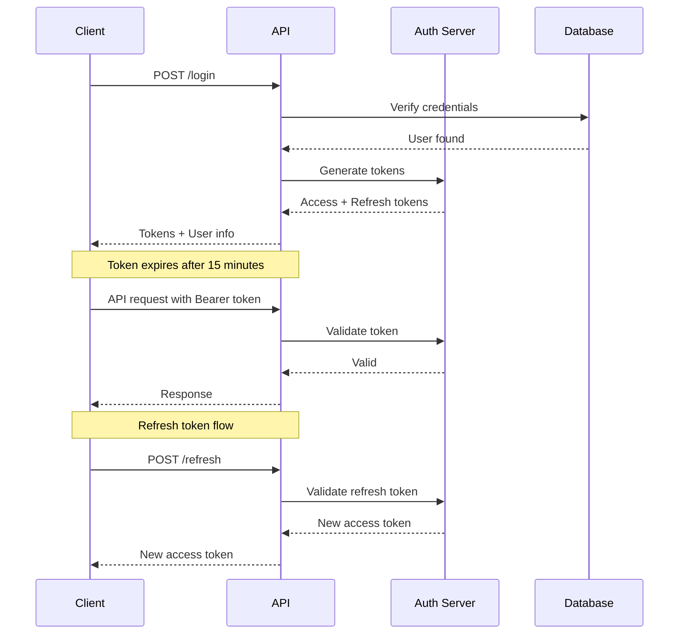

# Authentication API

The Authentication API provides secure endpoints for user authentication, token management, and session handling. All authentication endpoints use HTTPS and implement industry-standard security practices.

## Overview

V-COMM supports multiple authentication methods:

- **Email/Password**: Traditional credential-based authentication
- **OAuth 2.0**: Third-party provider authentication (Google, GitHub, Microsoft)
- **SAML 2.0**: Enterprise single sign-on
- **WebAuthn**: Passwordless authentication with security keys
- **Magic Link**: Passwordless email-based authentication

## Base URL

```
https://api.vcomm.io/v1/auth
```

## Authentication Flow



---

## Endpoints

### Login

Authenticates a user with email and password.

**Endpoint**: `POST /login`

**Request Body**:
```json
{
  "email": "user@example.com",
  "password": "securePassword123",
  "mfa_code": "123456",
  "device_name": "iPhone 15 Pro",
  "remember_me": true
}
```

**Parameters**:

| Parameter | Type | Required | Description |
|-----------|------|----------|-------------|
| `email` | string | Yes | User's email address |
| `password` | string | Yes | User's password |
| `mfa_code` | string | Conditional | MFA code if MFA is enabled |
| `device_name` | string | No | Name of the device for session tracking |
| `remember_me` | boolean | No | Extend refresh token lifetime |

**Response** (200 OK):
```json
{
  "success": true,
  "data": {
    "user": {
      "id": "usr_abc123",
      "email": "user@example.com",
      "username": "johndoe",
      "display_name": "John Doe",
      "avatar": "https://cdn.vcomm.io/avatars/usr_abc123.png",
      "created_at": "2024-01-15T10:30:00Z",
      "mfa_enabled": true
    },
    "tokens": {
      "access_token": "eyJhbGciOiJSUzI1NiIsInR5cCI6IkpXVCJ9...",
      "refresh_token": "ref_xyz789",
      "token_type": "Bearer",
      "expires_in": 900
    },
    "session": {
      "id": "sess_def456",
      "device_name": "iPhone 15 Pro",
      "ip_address": "192.168.1.100",
      "user_agent": "Mozilla/5.0...",
      "created_at": "2024-01-15T10:30:00Z",
      "expires_at": "2024-01-15T11:30:00Z"
    }
  }
}
```

**Error Responses**:

| Status | Code | Description |
|--------|------|-------------|
| 401 | `INVALID_CREDENTIALS` | Email or password is incorrect |
| 401 | `MFA_REQUIRED` | MFA code is required but not provided |
| 401 | `INVALID_MFA_CODE` | MFA code is invalid or expired |
| 403 | `ACCOUNT_LOCKED` | Account is temporarily locked due to failed attempts |
| 403 | `ACCOUNT_DISABLED` | Account has been disabled |
| 429 | `RATE_LIMITED` | Too many login attempts |

---

### Logout

Invalidates the current session and tokens.

**Endpoint**: `POST /logout`

**Headers**:
```
Authorization: Bearer <access_token>
```

**Request Body**:
```json
{
  "session_id": "sess_def456",
  "all_sessions": false
}
```

**Parameters**:

| Parameter | Type | Required | Description |
|-----------|------|----------|-------------|
| `session_id` | string | No | Specific session to logout |
| `all_sessions` | boolean | No | Logout from all devices |

**Response** (200 OK):
```json
{
  "success": true,
  "message": "Successfully logged out"
}
```

---

### Refresh Token

Obtains a new access token using a refresh token.

**Endpoint**: `POST /refresh`

**Request Body**:
```json
{
  "refresh_token": "ref_xyz789"
}
```

**Response** (200 OK):
```json
{
  "success": true,
  "data": {
    "access_token": "eyJhbGciOiJSUzI1NiIsInR5cCI6IkpXVCJ9...",
    "token_type": "Bearer",
    "expires_in": 900
  }
}
```

**Error Responses**:

| Status | Code | Description |
|--------|------|-------------|
| 401 | `INVALID_REFRESH_TOKEN` | Refresh token is invalid or expired |
| 401 | `TOKEN_REVOKED` | Token has been revoked |

---

### Register

Creates a new user account.

**Endpoint**: `POST /register`

**Request Body**:
```json
{
  "email": "newuser@example.com",
  "username": "newuser",
  "password": "securePassword123",
  "display_name": "New User",
  "invite_code": "INVITE123",
  "terms_accepted": true,
  "privacy_accepted": true
}
```

**Parameters**:

| Parameter | Type | Required | Description |
|-----------|------|----------|-------------|
| `email` | string | Yes | User's email address |
| `username` | string | Yes | Unique username (3-20 characters) |
| `password` | string | Yes | Password (min 8 characters) |
| `display_name` | string | No | Display name |
| `invite_code` | string | Conditional | Required if instance is invite-only |
| `terms_accepted` | boolean | Yes | Must be true |
| `privacy_accepted` | boolean | Yes | Must be true |

**Response** (201 Created):
```json
{
  "success": true,
  "data": {
    "user": {
      "id": "usr_new123",
      "email": "newuser@example.com",
      "username": "newuser",
      "display_name": "New User",
      "created_at": "2024-01-15T10:30:00Z"
    },
    "verification_required": true,
    "message": "Please check your email to verify your account"
  }
}
```

---

### Verify Email

Verifies a user's email address.

**Endpoint**: `POST /verify-email`

**Request Body**:
```json
{
  "token": "verify_abc123xyz"
}
```

**Response** (200 OK):
```json
{
  "success": true,
  "message": "Email verified successfully"
}
```

---

### Forgot Password

Initiates password reset process.

**Endpoint**: `POST /forgot-password`

**Request Body**:
```json
{
  "email": "user@example.com"
}
```

**Response** (200 OK):
```json
{
  "success": true,
  "message": "If the email exists, a reset link has been sent"
}
```

---

### Reset Password

Resets password using token from email.

**Endpoint**: `POST /reset-password`

**Request Body**:
```json
{
  "token": "reset_abc123xyz",
  "new_password": "newSecurePassword456"
}
```

**Response** (200 OK):
```json
{
  "success": true,
  "message": "Password reset successfully"
}
```

---

### OAuth Authentication

Initiates OAuth authentication flow.

**Endpoint**: `GET /oauth/{provider}`

**Supported Providers**: `google`, `github`, `microsoft`, `gitlab`, `discord`

**Response**: Redirects to provider's authorization page

**Callback Endpoint**: `GET /oauth/{provider}/callback`

**Parameters**:

| Parameter | Type | Description |
|-----------|------|-------------|
| `code` | string | Authorization code from provider |
| `state` | string | State parameter for CSRF protection |

**Response** (200 OK):
```json
{
  "success": true,
  "data": {
    "user": { ... },
    "tokens": { ... }
  }
}
```

---

### WebAuthn Registration

Initiates WebAuthn registration.

**Endpoint**: `POST /webauthn/register/start`

**Headers**:
```
Authorization: Bearer <access_token>
```

**Response** (200 OK):
```json
{
  "success": true,
  "data": {
    "challenge": "base64url-encoded-challenge",
    "rp": {
      "name": "V-COMM",
      "id": "vcomm.io"
    },
    "user": {
      "id": "usr_abc123",
      "name": "user@example.com",
      "displayName": "John Doe"
    },
    "pubKeyCredParams": [
      { "type": "public-key", "alg": -7 },
      { "type": "public-key", "alg": -257 }
    ]
  }
}
```

**Complete Registration**: `POST /webauthn/register/finish`

---

### WebAuthn Authentication

Initiates WebAuthn authentication.

**Endpoint**: `POST /webauthn/authenticate/start`

**Request Body**:
```json
{
  "email": "user@example.com"
}
```

**Response** (200 OK):
```json
{
  "success": true,
  "data": {
    "challenge": "base64url-encoded-challenge",
    "allowCredentials": [
      {
        "type": "public-key",
        "id": "credential-id",
        "transports": ["usb", "nfc", "ble", "internal"]
      }
    ]
  }
}
```

---

### Magic Link

Requests a magic link for passwordless authentication.

**Endpoint**: `POST /magic-link`

**Request Body**:
```json
{
  "email": "user@example.com"
}
```

**Response** (200 OK):
```json
{
  "success": true,
  "message": "If the email exists, a magic link has been sent"
}
```

**Verify Magic Link**: `GET /magic-link/verify?token=xxx`

---

## Session Management

### List Sessions

Lists all active sessions for the authenticated user.

**Endpoint**: `GET /sessions`

**Headers**:
```
Authorization: Bearer <access_token>
```

**Response** (200 OK):
```json
{
  "success": true,
  "data": {
    "sessions": [
      {
        "id": "sess_def456",
        "device_name": "iPhone 15 Pro",
        "device_type": "mobile",
        "ip_address": "192.168.1.100",
        "location": "San Francisco, CA",
        "user_agent": "Mozilla/5.0...",
        "created_at": "2024-01-15T10:30:00Z",
        "last_active": "2024-01-15T11:00:00Z",
        "is_current": true
      }
    ],
    "total": 1
  }
}
```

---

### Revoke Session

Revokes a specific session.

**Endpoint**: `DELETE /sessions/{session_id}`

**Response** (200 OK):
```json
{
  "success": true,
  "message": "Session revoked successfully"
}
```

---

## Token Information

### Token Structure

Access tokens are JWTs with the following claims:

```json
{
  "sub": "usr_abc123",
  "iat": 1705312200,
  "exp": 1705313100,
  "iss": "https://api.vcomm.io",
  "aud": "vcomm-api",
  "scope": "read write",
  "session_id": "sess_def456"
}
```

### Token Lifetimes

| Token Type | Lifetime | Refreshable |
|------------|----------|-------------|
| Access Token | 15 minutes | Yes |
| Refresh Token | 7 days (30 days with remember_me) | No |
| Verification Token | 24 hours | No |
| Password Reset Token | 1 hour | No |
| Magic Link Token | 15 minutes | No |

---

## Rate Limiting

Authentication endpoints have strict rate limiting:

| Endpoint | Limit | Window |
|----------|-------|--------|
| `/login` | 10 requests | 1 minute |
| `/register` | 5 requests | 1 hour |
| `/forgot-password` | 3 requests | 1 hour |
| `/refresh` | 60 requests | 1 minute |

Rate limit headers are included in responses:

```
X-RateLimit-Limit: 10
X-RateLimit-Remaining: 8
X-RateLimit-Reset: 1705312260
```

---

## Error Codes

| Code | HTTP Status | Description |
|------|-------------|-------------|
| `INVALID_CREDENTIALS` | 401 | Email or password is incorrect |
| `INVALID_TOKEN` | 401 | Token is invalid or expired |
| `TOKEN_EXPIRED` | 401 | Token has expired |
| `MFA_REQUIRED` | 401 | MFA verification required |
| `INVALID_MFA_CODE` | 401 | MFA code is invalid |
| `ACCOUNT_LOCKED` | 403 | Account is temporarily locked |
| `ACCOUNT_DISABLED` | 403 | Account is disabled |
| `ACCOUNT_UNVERIFIED` | 403 | Email not verified |
| `RATE_LIMITED` | 429 | Too many requests |
| `PASSWORD_TOO_WEAK` | 400 | Password doesn't meet requirements |
| `USERNAME_TAKEN` | 409 | Username already exists |
| `EMAIL_TAKEN` | 409 | Email already registered |

---

## SDK Examples

### JavaScript/TypeScript

```typescript
import { VCommClient } from '@vcomm/sdk';

const client = new VCommClient({
  baseURL: 'https://api.vcomm.io/v1'
});

// Login
const { user, tokens } = await client.auth.login({
  email: 'user@example.com',
  password: 'securePassword123'
});

// Store tokens
localStorage.setItem('access_token', tokens.access_token);
localStorage.setItem('refresh_token', tokens.refresh_token);

// Automatic token refresh
client.on('token-refreshed', (newToken) => {
  localStorage.setItem('access_token', newToken);
});

// Logout
await client.auth.logout();
```

### Python

```python
from vcomm import VCommClient

client = VCommClient(base_url='https://api.vcomm.io/v1')

# Login
auth = client.auth.login(
    email='user@example.com',
    password='securePassword123'
)

print(f"Logged in as {auth.user.display_name}")

# Store tokens
client.access_token = auth.tokens.access_token
client.refresh_token = auth.tokens.refresh_token

# Logout
client.auth.logout()
```

---

## Security Best Practices

1. **Always use HTTPS** - Never send credentials over unencrypted connections
2. **Store tokens securely** - Use httpOnly cookies or secure storage
3. **Implement token refresh** - Refresh tokens before expiration
4. **Use CSRF protection** - Include state parameter in OAuth flows
5. **Validate tokens** - Verify token signature and claims server-side
6. **Implement MFA** - Encourage users to enable multi-factor authentication
7. **Monitor sessions** - Regularly review active sessions
8. **Use secure passwords** - Enforce strong password policies

## Related Documentation

- [Users API](./users) - User management endpoints
- [Security Overview](../../security/overview) - Security architecture
- [Authentication Guide](../../security/authentication) - Authentication methods