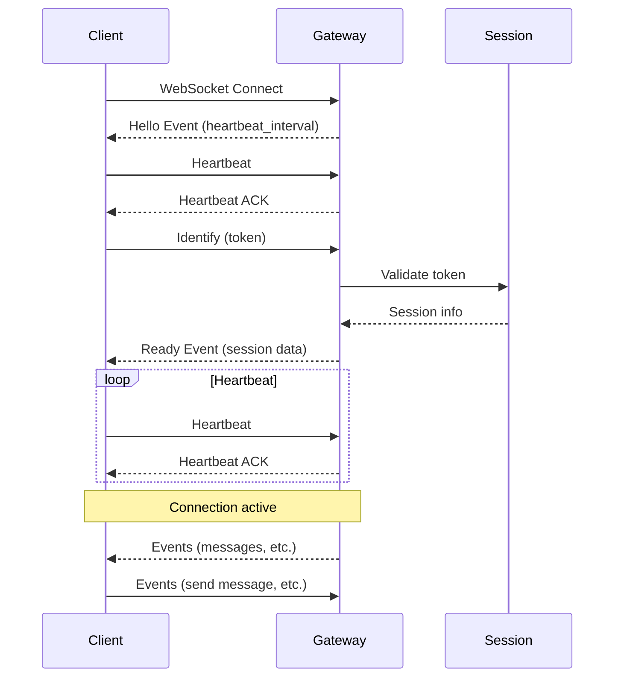
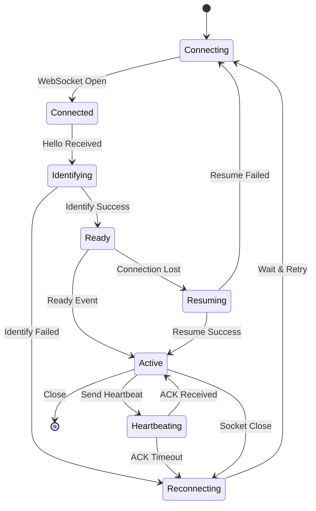

# WebSocket Connection

V-COMM uses WebSocket connections for real-time bidirectional communication.
This guide covers connection establishment, authentication, and lifecycle
management.

## Overview

WebSocket connections provide:

- **Real-time events**: Instant message delivery, presence updates
- **Low latency**: Sub-100ms message delivery
- **Efficient**: Single persistent connection vs. polling
- **Bidirectional**: Send and receive on same connection

## Gateway URL

```
wss://gateway.vcomm.io
```

**Regional Endpoints**:

| Region       | URL                              |
| ------------ | -------------------------------- |
| US East      | `wss://gateway-us-east.vcomm.io` |
| US West      | `wss://gateway-us-west.vcomm.io` |
| EU West      | `wss://gateway-eu-west.vcomm.io` |
| Asia Pacific | `wss://gateway-ap.vcomm.io`      |

---

## Connection Flow



---

## Connection Lifecycle

### Step 1: Open WebSocket

```javascript
const ws = new WebSocket('wss://gateway.vcomm.io?v=10&encoding=json');
```

**Query Parameters**:

| Parameter  | Type    | Description                  |
| ---------- | ------- | ---------------------------- |
| `v`        | integer | API version (current: 10)    |
| `encoding` | string  | Payload encoding (json, etf) |
| `compress` | boolean | Enable compression           |

### Step 2: Receive Hello

Upon connection, the gateway sends a Hello event:

```json
{
  "op": 10,
  "d": {
    "heartbeat_interval": 41250,
    "_trace": ["gateway-prd-main-abc123"]
  }
}
```

**Hello Data**:

| Field                | Type    | Description                     |
| -------------------- | ------- | ------------------------------- |
| `heartbeat_interval` | integer | Milliseconds between heartbeats |
| `_trace`             | array   | Debug trace information         |

### Step 3: Send Heartbeat

Start sending heartbeats immediately:

```json
{
  "op": 1,
  "d": 251
}
```

The `d` field should contain the last sequence number received, or `null` if
none.

### Step 4: Identify

Send identification payload:

```json
{
  "op": 2,
  "d": {
    "token": "your_access_token",
    "properties": {
      "os": "linux",
      "browser": "my_client",
      "device": "my_device"
    },
    "compress": false,
    "large_threshold": 250,
    "shard": [0, 1],
    "presence": {
      "status": "online",
      "since": null,
      "activities": [
        {
          "name": "Custom Status",
          "type": 4,
          "state": "Working"
        }
      ],
      "afk": false
    },
    "intents": 513
  }
}
```

**Identify Parameters**:

| Field             | Type    | Required | Description                     |
| ----------------- | ------- | -------- | ------------------------------- |
| `token`           | string  | Yes      | Access token                    |
| `properties`      | object  | Yes      | Client properties               |
| `compress`        | boolean | No       | Enable payload compression      |
| `large_threshold` | integer | No       | Large space threshold (50-250)  |
| `shard`           | array   | No       | Shard configuration [id, total] |
| `presence`        | object  | No       | Initial presence                |
| `intents`         | integer | Yes      | Event intents bitmask           |

### Step 5: Receive Ready

After successful identification:

```json
{
  "op": 0,
  "t": "READY",
  "s": 1,
  "d": {
    "v": 10,
    "user": {
      "id": "usr_abc123",
      "username": "johndoe",
      "discriminator": "0001",
      "avatar": "hash",
      "verified": true,
      "mfa_enabled": true
    },
    "spaces": [],
    "session_id": "sess_abc123",
    "resume_gateway_url": "wss://gateway.vcomm.io",
    "_trace": ["gateway-prd-main-abc123"]
  }
}
```

---

## Opcodes

| Opcode | Name                  | Direction     | Description           |
| ------ | --------------------- | ------------- | --------------------- |
| 0      | Dispatch              | Server→Client | Event dispatch        |
| 1      | Heartbeat             | Client→Server | Heartbeat             |
| 2      | Identify              | Client→Server | Authentication        |
| 3      | Presence Update       | Client→Server | Update presence       |
| 4      | Voice State Update    | Client→Server | Voice state           |
| 6      | Resume                | Client→Server | Resume connection     |
| 7      | Reconnect             | Server→Client | Reconnect request     |
| 8      | Request Guild Members | Client→Server | Request members       |
| 9      | Invalid Session       | Server→Client | Invalid session       |
| 10     | Hello                 | Server→Client | Connection hello      |
| 11     | Heartbeat ACK         | Server→Client | Heartbeat acknowledge |
| 13     | Call Connect          | Client→Server | Connect to call       |

---

## Intents

Intents control which events are received. Use bitwise OR to combine:

| Intent          | Value    | Description          |
| --------------- | -------- | -------------------- |
| SPACES          | `1 << 0` | Space events         |
| SPACE_MEMBERS   | `1 << 1` | Member events        |
| SPACE_MESSAGES  | `1 << 2` | Space message events |
| DIRECT_MESSAGES | `1 << 3` | DM events            |
| MESSAGE_CONTENT | `1 << 4` | Message content      |
| PRESENCES       | `1 << 5` | Presence updates     |
| TYPING          | `1 << 6` | Typing indicators    |
| REACTIONS       | `1 << 7` | Reaction events      |
| VOICE           | `1 << 8` | Voice events         |
| INVITES         | `1 << 9` | Invite events        |

**Privileged Intents** (require approval):

- `PRESENCES`
- `SPACE_MEMBERS`
- `MESSAGE_CONTENT`

---

## Heartbeating

### Send Heartbeat

```json
{
  "op": 1,
  "d": 251
}
```

### Receive ACK

```json
{
  "op": 11
}
```

**Heartbeat Rules**:

1. Send first heartbeat after random jitter: `interval * random(0, 1)`
2. Send subsequent heartbeats every `heartbeat_interval` ms
3. Wait for ACK before sending next heartbeat
4. If no ACK after 5 seconds, assume connection dead
5. Heartbeat timeout triggers reconnect

---

## Reconnection

### Resume Connection

Resume after disconnect without replaying all events:

```json
{
  "op": 6,
  "d": {
    "token": "your_access_token",
    "session_id": "sess_abc123",
    "seq": 251
  }
}
```

**Resume Data**:

| Field        | Type    | Description           |
| ------------ | ------- | --------------------- |
| `token`      | string  | Access token          |
| `session_id` | string  | Session ID from Ready |
| `seq`        | integer | Last sequence number  |

### Resume Success

Gateway replays missed events and sends Resumed event:

```json
{
  "op": 0,
  "t": "RESUMED",
  "s": 252,
  "d": {
    "_trace": ["gateway-prd-main-abc123"]
  }
}
```

### Invalid Session

If session is invalid:

```json
{
  "op": 9,
  "d": false
}
```

- `true`: Can resume, wait 1-5 seconds then try Resume
- `false`: Cannot resume, must re-Identify

---

## Connection States



---

## Sharding

For large-scale applications, use sharding to split events across multiple
connections:

### Calculate Shard Count

```
shards = ceil(members / 1000)
```

### Identify with Sharding

```json
{
  "op": 2,
  "d": {
    "token": "your_token",
    "shard": [0, 4],
    "intents": 513
  }
}
```

`[shard_id, num_shards]` - Connect to shard 0 of 4 total.

**Shard ID Formula**:

```
shard_id = (space_id >> 22) % num_shards
```

---

## Rate Limits

### Connection Limits

| Limit                   | Value              |
| ----------------------- | ------------------ |
| Max concurrent sessions | 1000               |
| Identify rate           | 1 per 5 seconds    |
| Connect rate            | 120 per 60 seconds |

### Event Limits

| Limit                | Value | Window     |
| -------------------- | ----- | ---------- |
| Events sent          | 120   | 60 seconds |
| Per-channel messages | 10    | 10 seconds |

**Rate Limit Handling**:

```json
{
  "op": 0,
  "t": "RATE_LIMIT",
  "d": {
    "retry_after": 5000,
    "limit": 120,
    "remaining": 0
  }
}
```

---

## Compression

### Payload Compression

Enable with `compress: true` in Identify:

```json
{
  "op": 2,
  "d": {
    "token": "your_token",
    "compress": true
  }
}
```

Large payloads (>16KB) are compressed using zlib.

### Transport Compression

Enable with `compress=true` query parameter:

```
wss://gateway.vcomm.io?compress=true
```

All payloads are compressed using zlib.

---

## Error Handling

### Close Codes

| Code | Reason                | Action                     |
| ---- | --------------------- | -------------------------- |
| 4000 | Unknown Error         | Reconnect                  |
| 4001 | Unknown Opcode        | Reconnect                  |
| 4002 | Decode Error          | Reconnect                  |
| 4003 | Not Authenticated     | Send Identify              |
| 4004 | Authentication Failed | Check token                |
| 4005 | Already Authenticated | Disconnect                 |
| 4007 | Invalid Seq           | Resume failed, re-Identify |
| 4008 | Rate Limited          | Wait then reconnect        |
| 4009 | Session Timed Out     | Resume or re-Identify      |
| 4010 | Invalid Shard         | Check shard config         |
| 4011 | Sharding Required     | Enable sharding            |
| 4012 | Invalid API Version   | Update client              |
| 4013 | Invalid Intents       | Check intent values        |
| 4014 | Disallowed Intents    | Request privileged intents |

---

## SDK Examples

### JavaScript/TypeScript

```typescript
import { WebSocket } from 'ws';

class VCommGateway {
  private ws: WebSocket | null = null;
  private heartbeatInterval: NodeJS.Timeout | null = null;
  private seq: number = 0;
  private sessionId: string | null = null;

  async connect(token: string) {
    this.ws = new WebSocket('wss://gateway.vcomm.io?v=10');

    this.ws.on('open', () => {
      console.log('WebSocket connected');
    });

    this.ws.on('message', (data) => {
      const payload = JSON.parse(data.toString());
      this.handlePayload(payload);
    });

    this.ws.on('close', (code, reason) => {
      console.log(`WebSocket closed: ${code} - ${reason}`);
      this.cleanup();
      // Attempt reconnect
      setTimeout(() => this.connect(token), 5000);
    });
  }

  private handlePayload(payload: any) {
    const { op, t, s, d } = payload;

    if (s) this.seq = s;

    switch (op) {
      case 10: // Hello
        this.startHeartbeat(d.heartbeat_interval);
        this.identify();
        break;
      case 11: // Heartbeat ACK
        console.log('Heartbeat ACK');
        break;
      case 0: // Dispatch
        this.handleEvent(t, d);
        break;
      case 9: // Invalid Session
        this.handleInvalidSession(d);
        break;
    }
  }

  private startHeartbeat(interval: number) {
    this.heartbeatInterval = setInterval(() => {
      this.send({ op: 1, d: this.seq });
    }, interval);
  }

  private identify() {
    this.send({
      op: 2,
      d: {
        token: this.token,
        properties: {
          os: process.platform,
          browser: 'my_client',
          device: 'my_device',
        },
        intents: 513,
      },
    });
  }

  private send(payload: any) {
    this.ws?.send(JSON.stringify(payload));
  }

  private handleEvent(event: string, data: any) {
    if (event === 'READY') {
      this.sessionId = data.session_id;
      console.log('Ready!', data.user.username);
    }
  }

  private handleInvalidSession(resumable: boolean) {
    this.cleanup();
    if (resumable) {
      this.resume();
    } else {
      this.identify();
    }
  }

  private resume() {
    this.send({
      op: 6,
      d: {
        token: this.token,
        session_id: this.sessionId,
        seq: this.seq,
      },
    });
  }

  private cleanup() {
    if (this.heartbeatInterval) {
      clearInterval(this.heartbeatInterval);
      this.heartbeatInterval = null;
    }
  }
}
```

### Python

```python
import json
import asyncio
import websockets

class VCommGateway:
    def __init__(self, token: str):
        self.token = token
        self.ws = None
        self.seq = None
        self.session_id = None
        self.heartbeat_interval = None

    async def connect(self):
        async with websockets.connect(
            'wss://gateway.vcomm.io?v=10'
        ) as ws:
            self.ws = ws
            await self.listen()

    async def listen(self):
        while True:
            data = await self.ws.recv()
            payload = json.loads(data)
            await self.handle_payload(payload)

    async def handle_payload(self, payload: dict):
        op = payload.get('op')

        if 's' in payload:
            self.seq = payload['s']

        if op == 10:  # Hello
            self.heartbeat_interval = payload['d']['heartbeat_interval']
            asyncio.create_task(self.heartbeat_loop())
            await self.identify()
        elif op == 11:  # Heartbeat ACK
            pass
        elif op == 0:  # Dispatch
            await self.handle_event(payload['t'], payload['d'])
        elif op == 9:  # Invalid Session
            await self.handle_invalid_session(payload['d'])

    async def heartbeat_loop(self):
        while True:
            await asyncio.sleep(self.heartbeat_interval / 1000)
            await self.send({'op': 1, 'd': self.seq})

    async def identify(self):
        await self.send({
            'op': 2,
            'd': {
                'token': self.token,
                'properties': {
                    'os': 'linux',
                    'browser': 'my_client',
                    'device': 'my_device'
                },
                'intents': 513
            }
        })

    async def send(self, payload: dict):
        await self.ws.send(json.dumps(payload))

    async def handle_event(self, event: str, data: dict):
        if event == 'READY':
            self.session_id = data['session_id']
            print(f"Ready! Logged in as {data['user']['username']}")

    async def handle_invalid_session(self, resumable: bool):
        if resumable:
            await self.resume()
        else:
            await self.identify()

    async def resume(self):
        await self.send({
            'op': 6,
            'd': {
                'token': self.token,
                'session_id': self.session_id,
                'seq': self.seq
            }
        })
```

---

## Best Practices

1. **Implement exponential backoff** for reconnection attempts
2. **Store session_id and last seq** for resuming connections
3. **Handle rate limits** gracefully with queuing
4. **Use compression** for bandwidth efficiency
5. **Implement sharding** for high-traffic bots
6. **Monitor connection health** with heartbeat timing
7. **Handle all close codes** appropriately

---

## Related Documentation

- [WebSocket Events](./events) - Event types and payloads
- [WebSocket Gateway](./gateway) - Advanced gateway features
- [Channels API](../rest/channels) - REST API for channels
