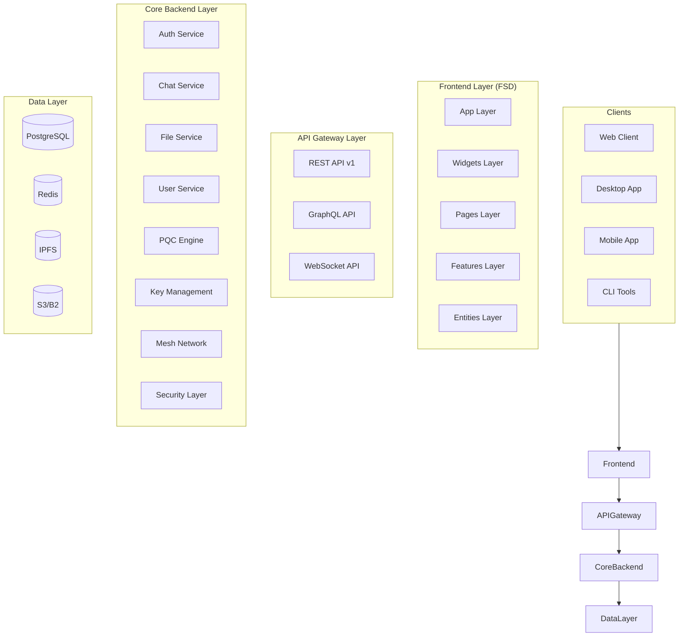
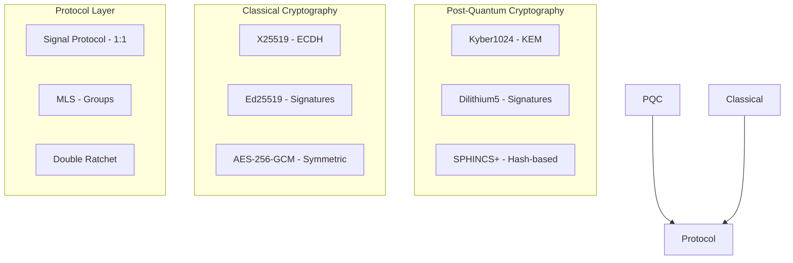
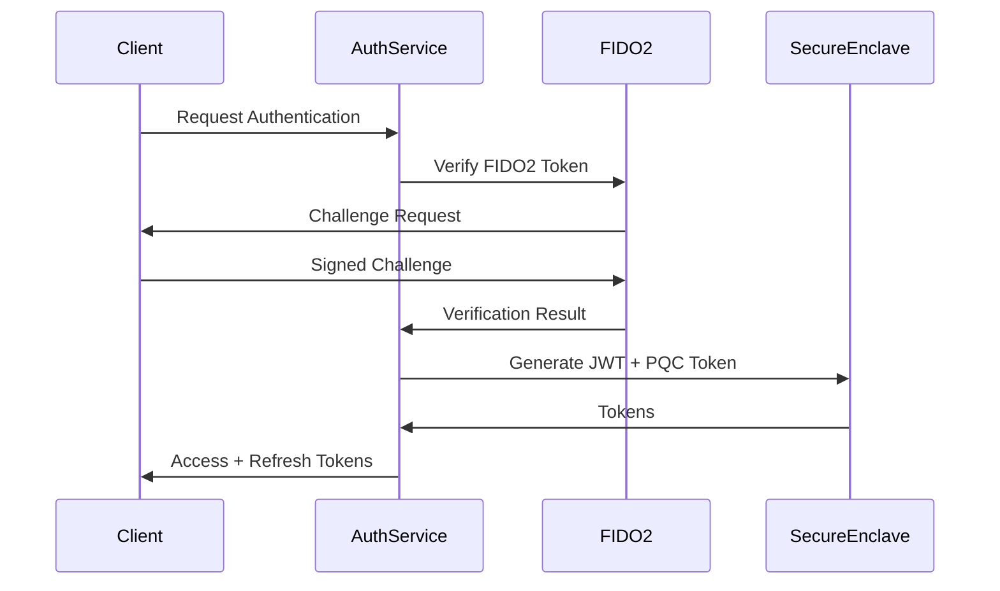
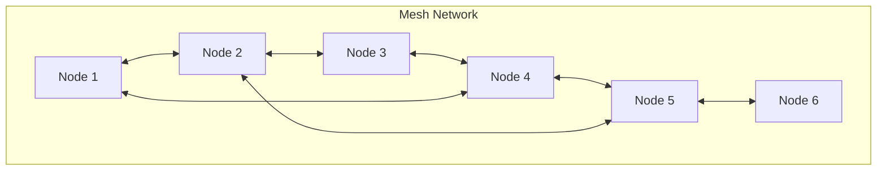
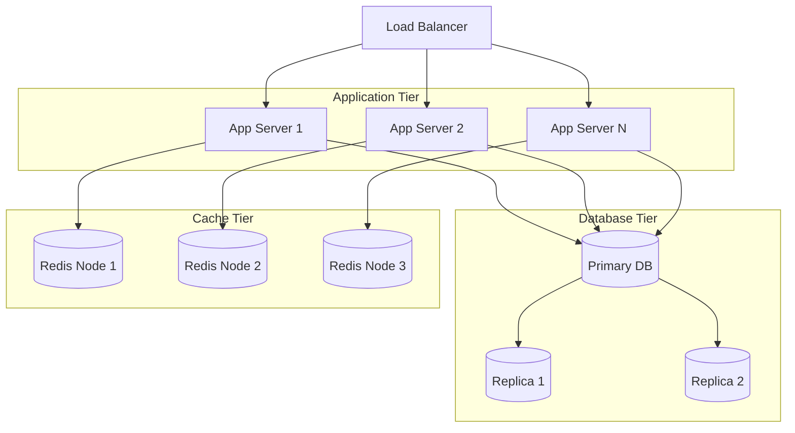

# Architecture Overview

This document provides a comprehensive overview of V-COMM's architecture, design decisions, and technical implementation.

## High-Level Architecture



## Core Principles

### Zero Trust Architecture

V-COMM is built on Zero Trust principles where:

1. **Never Trust, Always Verify**: Every request is authenticated and authorized
2. **Least Privilege Access**: Users and services have minimal required permissions
3. **Micro-segmentation**: Network is divided into secure zones
4. **Continuous Monitoring**: All actions are logged and analyzed
5. **Assume Breach**: Security is designed assuming the network is compromised

### Privacy by Design

- End-to-end encryption for all communications
- Client-side encryption for all data
- No access to user data by operators
- Anonymous usage options

### Decentralization

- Mesh networking for offline communication
- IPFS for distributed storage
- No single point of failure
- Censorship-resistant design

## Monorepo Structure

V-COMM uses a Turborepo monorepo with Feature-Sliced Design (FSD):

```
VChat/
├── .github/                    # GitHub configuration
│   ├── workflows/              # CI/CD workflows
│   ├── ISSUE_TEMPLATE/         # Issue templates
│   └── CODEOWNERS              # Code ownership
├── docs/                       # Documentation
│   └── wiki/                   # Wiki pages
├── infra/                      # Infrastructure as Code
│   ├── terraform/              # Terraform configurations
│   └── kubernetes/             # K8s manifests
├── packages/                   # Main packages
│   ├── core/                   # Rust backend core
│   │   ├── src/
│   │   │   ├── crypto/         # Cryptographic implementations
│   │   │   ├── network/        # Networking layer
│   │   │   ├── storage/        # Storage abstraction
│   │   │   ├── auth/           # Authentication
│   │   │   └── api/            # API handlers
│   │   └── Cargo.toml
│   ├── frontend/               # TypeScript frontend
│   │   ├── src/
│   │   │   ├── app/            # App provider & routes
│   │   │   ├── pages/          # Page components
│   │   │   ├── widgets/        # UI widgets
│   │   │   ├── features/       # Feature modules
│   │   │   ├── entities/       # Business entities
│   │   │   └── shared/         # Shared utilities
│   │   └── package.json
│   ├── crypto-wasm/            # WASM crypto bindings
│   ├── bots/                   # V-BOTS SDK
│   ├── mobile/                 # React Native mobile app
│   └── desktop/                # Tauri desktop app
├── tools/                      # Development tools
│   ├── scripts/                # Utility scripts
│   └── configs/                # Shared configurations
├── Makefile                    # Automation commands
├── turbo.json                  # Turborepo configuration
├── package.json                # Workspace configuration
└── tsconfig.json               # TypeScript configuration
```

## Technology Stack

### Backend

| Technology | Version | Purpose |
|------------|---------|---------|
| **Rust** | 1.75+ | Primary backend language |
| **Ferrocene** | - | Safety-critical Rust compiler |
| **Actix-web** | 4.x | Web framework |
| **Diesel/SeaORM** | - | Database ORM |
| **liboqs** | - | Post-Quantum Cryptography |

### Frontend

| Technology | Version | Purpose |
|------------|---------|---------|
| **TypeScript** | 5.x | Type-safe JavaScript |
| **Next.js** | 14+ | React framework |
| **Zustand** | - | State management |
| **Tailwind CSS** | 3.x | Utility-first CSS |
| **Radix UI** | - | Accessible components |

### Data Layer

| Technology | Version | Purpose |
|------------|---------|---------|
| **PostgreSQL** | 16.x | Primary database |
| **Redis** | 7.x | Cache and pub/sub |
| **IPFS** | - | Distributed storage |
| **S3/Backblaze** | - | Object storage |

### Infrastructure

| Technology | Version | Purpose |
|------------|---------|---------|
| **Docker** | 24.x | Containerization |
| **Kubernetes** | 1.28+ | Orchestration |
| **Terraform** | 1.6+ | Infrastructure as Code |
| **Nginx** | 1.25+ | Reverse proxy |

## API Architecture

### REST API

Traditional HTTP endpoints for CRUD operations:

```
GET    /v1/channels          # List channels
POST   /v1/channels          # Create channel
GET    /v1/channels/:id      # Get channel
PATCH  /v1/channels/:id      # Update channel
DELETE /v1/channels/:id      # Delete channel
```

### GraphQL API

Flexible query language for complex data fetching:

```graphql
query GetChannels {
  channels {
    id
    name
    messages(first: 10) {
      edges {
        node {
          id
          content
        }
      }
    }
  }
}
```

### WebSocket API

Real-time communication for live updates:

```javascript
const ws = new WebSocket('wss://api.vcomm.app/ws');
ws.onmessage = (event) => {
  const data = JSON.parse(event.data);
  console.log('Event:', data.t, 'Data:', data.d);
};
```

## Security Architecture

### Cryptographic Stack



### Authentication Flow



## Network Architecture

### Protocol Stack

| Layer | Protocol | Purpose |
|-------|----------|---------|
| L7 | WebSocket | Real-time messaging |
| L7 | HTTP/3 (QUIC) | API communication |
| L7 | WebRTC | Voice/Video/Screen share |
| L6 | TLS 1.3 | Transport encryption |
| L4 | QUIC | Multiplexed streams |
| L3 | IPv4/IPv6 | Network layer |

### Mesh Networking

V-COMM supports offline communication through mesh networking:



**Features**:
- Store-and-forward messaging
- Automatic route discovery
- End-to-end encryption across hops
- Self-healing topology

## Data Architecture

### Storage Strategy

| Storage Type | Technology | Use Case |
|--------------|------------|----------|
| **Hot** | Redis | Sessions, Presence, Rate Limits |
| **Warm** | PostgreSQL | Users, Channels, Messages |
| **Cold** | S3/Backblaze | Archives, Logs, Exports |
| **Decentralized** | IPFS | Backups, Code, Public Files |

### Database Schema (Simplified)

```sql
-- Users
CREATE TABLE users (
    id UUID PRIMARY KEY,
    public_key BYTEA NOT NULL,
    pqc_public_key BYTEA,
    created_at TIMESTAMPTZ DEFAULT NOW(),
    settings JSONB DEFAULT '{}'
);

-- Channels
CREATE TABLE channels (
    id UUID PRIMARY KEY,
    type TEXT CHECK (type IN ('TXT', 'ROOM', 'FORUM', 'TICKET')),
    owner_id UUID REFERENCES users(id),
    encryption_key BYTEA,
    created_at TIMESTAMPTZ DEFAULT NOW()
);

-- Messages
CREATE TABLE messages (
    id UUID PRIMARY KEY,
    channel_id UUID REFERENCES channels(id),
    sender_id UUID REFERENCES users(id),
    content BYTEA NOT NULL,  -- Encrypted
    nonce BYTEA NOT NULL,
    created_at TIMESTAMPTZ DEFAULT NOW()
);
```

## Scalability

### Horizontal Scaling



## Related Topics

- [Zero Trust Architecture](./zero-trust.md)
- [Cryptography Implementation](./cryptography.md)
- [Network Architecture](./network.md)