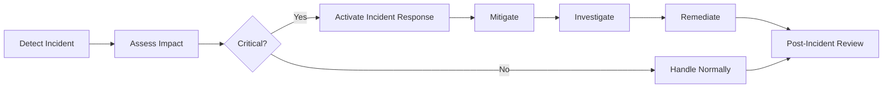

# Production Deployment Guide

## Overview

This guide provides comprehensive instructions for deploying V-COMM in production environments, covering security hardening, monitoring setup, disaster recovery, and operational best practices.

## Pre-Deployment Checklist

### Infrastructure Requirements

| Component | Minimum | Recommended | Notes |
|-----------|---------|-------------|-------|
| Kubernetes Cluster | 3 nodes, 8 vCPU, 32 GB RAM | 5+ nodes, 32 vCPU, 128 GB RAM | Multi-AZ deployment |
| Database (PostgreSQL) | 2 vCPU, 8 GB RAM, 100 GB storage | 8 vCPU, 32 GB RAM, 500 GB storage | Multi-AZ with replicas |
| Redis | 2 vCPU, 4 GB RAM | 8 vCPU, 32 GB RAM | Cluster mode with replicas |
| Object Storage | 500 GB | 5 TB+ | Replication across regions |
| CDN | - | Required | CloudFront, Cloudflare, etc. |

### Security Requirements

- [ ] TLS 1.3 enabled everywhere
- [ ] WAF configured and active
- [ ] DDoS protection enabled
- [ ] Database encryption at rest
- [ ] Secrets management (Vault, AWS Secrets Manager, etc.)
- [ ] Network policies configured
- [ ] Pod Security Standards enforced
- [ ] Image vulnerability scanning
- [ ] RBAC with least privilege

### Monitoring Requirements

- [ ] Metrics collection (Prometheus)
- [ ] Logging (ELK, CloudWatch, etc.)
- [ ] Tracing (Jaeger, Datadog APM)
- [ ] Uptime monitoring
- [ ] Synthetic monitoring
- [ ] Alerting configured (PagerDuty, Opsgenie, etc.)
- [ ] Dashboards created

## Security Hardening

### Network Security

```yaml
# WAF rules for V-COMM
apiVersion: wafregional.amazonaws.com/v1
kind: WAFRuleGroup
metadata:
  name: vcomm-waf-rules
spec:
  rules:
    # SQL Injection protection
    - name: SQLInjection
      action: BLOCK
      matchConditions:
        - type: SQL_INJECTION
      
    # XSS protection
    - name: XSS
      action: BLOCK
      matchConditions:
        - type: XSS
      
    # Rate limiting
    - name: RateLimit
      action: BLOCK
      rateLimit:
        limit: 1000
        window: 60
      
    # Size restrictions
    - name: MaxSize
      action: BLOCK
      sizeConstraint:
        fieldSize: 10485760  # 10 MB
```

### Database Security

```sql
-- Create secure database users
CREATE USER vcomm_app WITH ENCRYPTED PASSWORD '<secure-password>';
CREATE USER vcomm_readonly WITH ENCRYPTED PASSWORD '<secure-password>';

-- Grant minimal permissions
GRANT CONNECT ON DATABASE vcomm TO vcomm_app;
GRANT USAGE, SELECT ON ALL SEQUENCES IN SCHEMA public TO vcomm_app;
GRANT SELECT, INSERT, UPDATE, DELETE ON ALL TABLES IN SCHEMA public TO vcomm_app;

GRANT CONNECT ON DATABASE vcomm TO vcomm_readonly;
GRANT SELECT ON ALL TABLES IN SCHEMA public TO vcomm_readonly;

-- Enable row-level security
ALTER TABLE messages ENABLE ROW LEVEL SECURITY;
CREATE POLICY user_messages ON messages
  FOR SELECT
  TO vcomm_app
  USING (user_id = current_user_id());
```

### Secrets Management

```bash
# Using HashiCorp Vault
vault kv put secret/vcomm/production \
  database_password=$(openssl rand -base64 32) \
  redis_password=$(openssl rand -base64 32) \
  jwt_secret=$(openssl rand -base64 64) \
  encryption_key=$(openssl rand -base64 32)

# Enable automatic rotation
vault secrets enable -path=vcomm rotation
vault write vcomm/config/rotation \
  secret_id="secret/vcomm/production" \
  rotation_period="8760h"  # 1 year
```

## Monitoring Setup

### Prometheus Configuration

```yaml
# prometheus.yml
global:
  scrape_interval: 15s
  evaluation_interval: 15s

scrape_configs:
  - job_name: 'vcomm-core'
    kubernetes_sd_configs:
      - role: pod
    relabel_configs:
      - source_labels: [__meta_kubernetes_pod_label_app_kubernetes_io_name]
        action: keep
        regex: vcomm-core
      - source_labels: [__meta_kubernetes_pod_name]
        target_label: pod
      - source_labels: [__meta_kubernetes_namespace]
        target_label: namespace

  - job_name: 'vcomm-auth'
    kubernetes_sd_configs:
      - role: pod
    relabel_configs:
      - source_labels: [__meta_kubernetes_pod_label_app_kubernetes_io_name]
        action: keep
        regex: vcomm-auth

alerting:
  alertmanagers:
    - static_configs:
        - targets:
            - alertmanager:9093

rule_files:
  - '/etc/prometheus/rules/*.yml'
```

### Alert Rules

```yaml
# alerts.yml
groups:
  - name: vcomm_alerts
    interval: 30s
    rules:
      # Health alerts
      - alert: VCommHighErrorRate
        expr: |
          rate(vcomm_http_requests_total{status=~"5.."}[5m]) / 
          rate(vcomm_http_requests_total[5m]) > 0.05
        for: 5m
        labels:
          severity: critical
          service: vcomm-core
        annotations:
          summary: "High error rate detected"
          description: "Error rate is {{ $value | humanizePercentage }}"

      # Performance alerts
      - alert: VCommHighLatency
        expr: |
          histogram_quantile(0.99, 
            rate(vcomm_http_request_duration_seconds_bucket[5m])
          ) > 1
        for: 10m
        labels:
          severity: warning
          service: vcomm-core
        annotations:
          summary: "High latency detected"
          description: "P99 latency is {{ $value }}s"

      # Resource alerts
      - alert: VCommHighCPUUsage
        expr: rate(container_cpu_usage_seconds_total[5m]) > 0.8
        for: 10m
        labels:
          severity: warning
        annotations:
          summary: "High CPU usage"
          description: "CPU usage is {{ $value | humanizePercentage }}"

      - alert: VCommHighMemoryUsage
        expr: container_memory_usage_bytes / container_spec_memory_limit_bytes > 0.9
        for: 5m
        labels:
          severity: critical
        annotations:
          summary: "High memory usage"
          description: "Memory usage is {{ $value | humanizePercentage }}"

      # Database alerts
      - alert: VCommDatabaseConnectionsHigh
        expr: vcomm_database_connections / vcomm_database_max_connections > 0.8
        for: 5m
        labels:
          severity: warning
        annotations:
          summary: "Database connection pool nearly full"
          description: "{{ $value | humanizePercentage }} of connections used"

      - alert: VCommDatabaseReplicationLag
        expr: vcomm_database_replication_lag_seconds > 30
        for: 5m
        labels:
          severity: critical
        annotations:
          summary: "Database replication lag detected"
          description: "Replication lag is {{ $value }}s"
```

### Grafana Dashboards

```json
{
  "dashboard": {
    "title": "V-COMM Production Overview",
    "panels": [
      {
        "title": "Request Rate",
        "targets": [
          {
            "expr": "rate(vcomm_http_requests_total[5m])"
          }
        ]
      },
      {
        "title": "Error Rate",
        "targets": [
          {
            "expr": "rate(vcomm_http_requests_total{status=~'5..'}[5m])"
          }
        ]
      },
      {
        "title": "Latency (P95)",
        "targets": [
          {
            "expr": "histogram_quantile(0.95, rate(vcomm_http_request_duration_seconds_bucket[5m]))"
          }
        ]
      },
      {
        "title": "Active Connections",
        "targets": [
          {
            "expr": "vcomm_websocket_connections_active"
          }
        ]
      }
    ]
  }
}
```

## Disaster Recovery

### Backup Strategy

```yaml
# Velero backup configuration
apiVersion: velero.io/v1
kind: BackupStorageLocation
metadata:
  name: default
  namespace: velero
spec:
  provider: aws
  objectStorage:
    bucket: vcomm-backups
    prefix: velero
  config:
    region: us-east-1

---
apiVersion: velero.io/v1
kind: Schedule
metadata:
  name: vcomm-daily-backup
  namespace: velero
spec:
  schedule: "0 2 * * *"
  template:
    includedNamespaces:
      - vcomm
    excludedResources:
      - events
    snapshotVolumes: true
    ttl: 720h
    storageLocation: default
    volumeSnapshotLocations:
      - vcomm-snapshots
```

### Recovery Procedures

```bash
# List available backups
velero backup get

# Restore from backup
velero restore create --from-backup vcomm-daily-backup-20240115

# Verify restore
kubectl get all -n vcomm
```

### Multi-Region Deployment

```yaml
# DNS failover configuration
apiVersion: networking.gke.io/v1
kind: ManagedCertificate
metadata:
  name: vcomm-certificate
spec:
  domains:
    - vcomm.io
    - *.vcomm.io

---
apiVersion: cloud.google.com/v1
kind: BackendConfig
metadata:
  name: vcomm-backend-config
spec:
  healthCheck:
    checkIntervalSec: 5
    timeoutSec: 5
    healthyThreshold: 2
    unhealthyThreshold: 3
    type: HTTP
    requestPath: /health
  securityPolicy:
    name: vcomm-security-policy

---
apiVersion: networking.k8s.io/v1
kind: Ingress
metadata:
  name: vcomm-ingress
  annotations:
    kubernetes.io/ingress.class: gce
    networking.gke.io/managed-certificates: vcomm-certificate
    networking.gke.io/v1beta1.BackendConfig: vcomm-backend-config
spec:
  rules:
    - host: vcomm.io
      http:
        paths:
          - path: /*
            pathType: ImplementationSpecific
            backend:
              service:
                name: vcomm-gateway
                port:
                  number: 8080
```

## Performance Optimization

### Database Optimization

```sql
-- Create indexes for common queries
CREATE INDEX CONCURRENTLY idx_messages_channel_id ON messages(channel_id);
CREATE INDEX CONCURRENTLY idx_messages_user_id ON messages(user_id);
CREATE INDEX CONCURRENTLY idx_messages_created_at ON messages(created_at DESC);
CREATE INDEX CONCURRENTLY idx_users_email ON users(email);

-- Partition large tables
CREATE TABLE messages_2024 PARTITION OF messages
  FOR VALUES FROM ('2024-01-01') TO ('2025-01-01');

-- Update statistics regularly
ANALYZE messages;
ANALYZE users;
```

### Caching Strategy

```yaml
# Redis configuration
apiVersion: v1
kind: ConfigMap
metadata:
  name: redis-config
  namespace: vcomm
data:
  redis.conf: |
    maxmemory 8gb
    maxmemory-policy allkeys-lru
    timeout 0
    tcp-keepalive 300
    save 900 1
    save 300 10
    save 60 10000
    appendonly yes
    appendfsync everysec
```

### CDN Configuration

```yaml
# CloudFront distribution
resource "aws_cloudfront_distribution" "vcomm" {
  enabled             = true
  default_root_object = "index.html"
  
  origin {
    domain_name = var.api_domain
    origin_id   = "vcomm-api"
    
    custom_origin_config {
      http_port              = 80
      https_port             = 443
      origin_protocol_policy = "https-only"
      origin_ssl_protocols   = ["TLSv1.2", "TLSv1.3"]
    }
  }
  
  default_cache_behavior {
    target_origin_id       = "vcomm-api"
    viewer_protocol_policy = "redirect-to-https"
    
    allowed_methods = ["GET", "HEAD", "OPTIONS", "PUT", "POST", "PATCH", "DELETE"]
    cached_methods  = ["GET", "HEAD"]
    
    forwarded_values {
      query_string = false
      cookies {
        forward = "none"
      }
    }
    
    compress = true
    min_ttl  = 0
    default_ttl = 3600
    max_ttl     = 86400
  }
  
  viewer_certificate {
    acm_certificate_arn      = var.acm_certificate_arn
    ssl_support_method       = "sni-only"
    minimum_protocol_version = "TLSv1.2_2021"
  }
  
  restrictions {
    geo_restriction {
      restriction_type = "none"
    }
  }
}
```

## Operational Procedures

### Rolling Updates

```bash
# Update V-COMM version
helm upgrade vcomm vcomm/vcomm \
  --namespace vcomm \
  --values values-production.yaml \
  --set global.imageTag=v1.1.0 \
  --wait

# Monitor rollout
kubectl rollout status deployment/vcomm-core -n vcomm

# Check pods
kubectl get pods -n vcomm -w
```

### Blue-Green Deployment

```bash
# Deploy new version to green environment
kubectl apply -f vcomm-green.yaml

# Verify health
kubectl run test --image=curlimages/curl --rm -it -- \
  curl http://vcomm-green.vcomm.svc.cluster.local/health

# Switch traffic
kubectl patch service vcomm-gateway -p '{"spec":{"selector":{"version":"green"}}}'

# Monitor for issues
# If issues: switch back
kubectl patch service vcomm-gateway -p '{"spec":{"selector":{"version":"blue"}}}'
```

### Incident Response



## Compliance

### Audit Logging

```yaml
# Fluentd configuration for audit logs
apiVersion: v1
kind: ConfigMap
metadata:
  name: fluentd-config
  namespace: vcomm
data:
  fluent.conf: |
    <source>
      @type tail
      path /var/log/containers/*.log
      pos_file /var/log/fluentd-containers.log.pos
      tag kubernetes.*
      read_from_head true
      <parse>
        @type json
        time_format %Y-%m-%dT%H:%M:%S.%NZ
      </parse>
    </source>
    
    <filter kubernetes.**>
      @type kubernetes_metadata
    </filter>
    
    <match kubernetes.**>
      @type elasticsearch
      host elasticsearch.logging.svc.cluster.local
      port 9200
      index_name vcomm-audit
      type_name _doc
      <buffer>
        @type file
        path /var/log/fluentd-buffers/kubernetes.system.buffer
        flush_mode interval
        flush_interval 5s
      </buffer>
    </match>
```

### Data Retention

```sql
-- Configure automatic data retention
CREATE OR REPLACE FUNCTION archive_old_messages()
RETURNS void AS $$
BEGIN
  -- Archive messages older than 90 days to cold storage
  INSERT INTO messages_archive
  SELECT * FROM messages
  WHERE created_at < NOW() - INTERVAL '90 days';
  
  -- Delete archived messages
  DELETE FROM messages
  WHERE created_at < NOW() - INTERVAL '90 days';
END;
$$ LANGUAGE plpgsql;

-- Schedule daily execution
CREATE EXTENSION IF NOT EXISTS pg_cron;

SELECT cron.schedule(
  'archive-messages',
  '0 2 * * *',  -- Daily at 2 AM
  'SELECT archive_old_messages();'
);
```

## Checklists

### Pre-Go-Live Checklist

- [ ] All security requirements met
- [ ] Monitoring and alerting configured
- [ ] Backups configured and tested
- [ ] Disaster recovery procedures documented
- [ ] Load testing completed
- [ ] DNS configured and propagated
- [ ] SSL/TLS certificates valid
- [ ] CDN configured and cached
- [ ] Database optimized and indexed
- [ ] Redis configured for production
- [ ] Log retention policies set
- [ ] Rate limiting configured
- [ ] WAF rules active
- [ ] DDoS protection enabled
- [ ] On-call rotation established
- [ ] Incident response plan tested

### Post-Deployment Checklist

- [ ] Health checks passing
- [ ] No critical alerts
- [ ] Performance metrics within SLA
- [ ] Error rate below threshold
- [ ] Database replication healthy
- [ ] Redis cluster stable
- [ ] CDN cache warming
- [ ] Backup successful
- [ ] Monitoring dashboards reviewed
- [ ] Documentation updated

## See Also

- [Kubernetes Deployment](./kubernetes)
- [Terraform Infrastructure](./terraform)
- [Security Best Practices](../security/best-practices)
- [Architecture Overview](../architecture/overview)