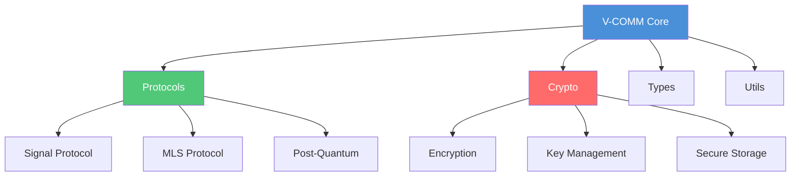
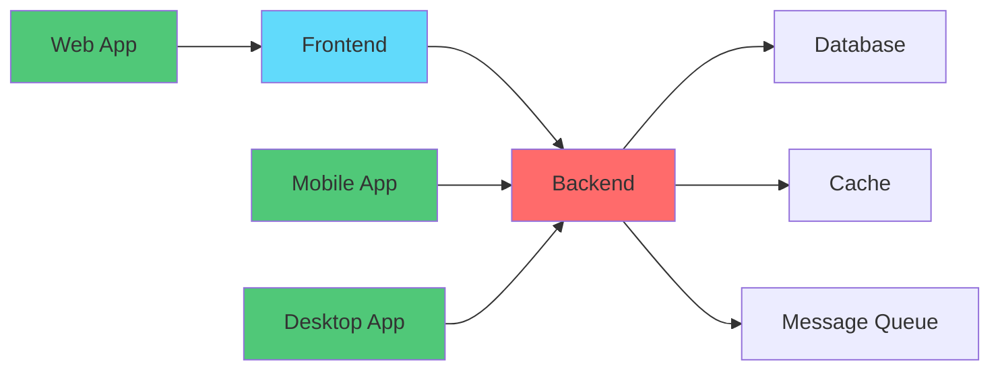

# 🗺️ Interactive Roadmap

This page provides an interactive view of V-COMM's development progress and future plans.

## 📊 Overall Progress

| Category | Completion | Status |
|----------|------------|--------|
| 🔐 Security | 45% | 🔄 In Progress |
| 💬 Messaging | 20% | 🔄 In Progress |
| 🎥 Voice/Video | 5% | 📅 Planned |
| 🤖 AI Features | 10% | 📅 Planned |
| 🌐 Web3 | 5% | 📅 Planned |

## 🏗️ Architecture Components

### Core Packages

### Application Stack

## 📅 Development Phases

### Phase 1: Foundation ✅

- [x] Monorepo setup with Turborepo
- [x] CI/CD pipeline with GitHub Actions
- [x] Security scanning (Gitleaks, Trivy)
- [x] Documentation site (Docusaurus)
- [x] Core package structure
- [x] Community documentation

### Phase 2: Security Layer 🔄

- [ ] Signal Protocol implementation
- [ ] MLS Protocol for group encryption
- [ ] Post-Quantum Cryptography (Kyber, Dilithium)
- [ ] FIDO2/WebAuthn authentication
- [ ] Secure Enclave key storage
- [ ] Zero Trust architecture

### Phase 3: Core Features 📅

- [ ] V-CHANNELS (TXT, ROOMS, FEEDBACK)
- [ ] Direct messaging with E2E encryption
- [ ] Group channels with MLS
- [ ] File attachments with encryption
- [ ] Message reactions and replies
- [ ] Rich text formatting

### Phase 4: Voice & Video 📅

- [ ] WebRTC implementation
- [ ] AV1 video codec support
- [ ] Opus audio codec
- [ ] Lyra V2 AI codec for low bandwidth
- [ ] Screen sharing
- [ ] Live streaming capabilities

### Phase 5: Advanced Features 📅

- [ ] V-SPACES (dynamic guilds)
- [ ] V-TICKETS (whistleblower system)
- [ ] V-FORUMS with cryptographic validation
- [ ] V-DRIVE (P2P encrypted storage)
- [ ] V-MESH (offline communication)
- [ ] V-MIGRATOR (platform migration tool)

## 🎯 Key Milestones

<strong>🏁 M1: Alpha Release</strong>

**Target:** Q1 2025

**Deliverables:**
- Basic messaging functionality
- Signal Protocol encryption
- User authentication
- Basic UI/UX

**Success Criteria:**
- [ ] 100+ test users
- [ ] < 100ms message latency
- [ ] 99.9% uptime
- [ ] Zero security vulnerabilities

<strong>🚀 M2: Beta Release</strong>

**Target:** Q2 2025

**Deliverables:**
- Group messaging with MLS
- Voice/video calls
- File sharing
- Mobile apps (iOS/Android)

**Success Criteria:**
- [ ] 1,000+ active users
- [ ] Voice/video quality > 4.0
- [ ] < 5s file upload time (10MB)
- [ ] App store rating > 4.0

<strong>🌟 M3: Production Release</strong>

**Target:** Q4 2025

**Deliverables:**
- All core features complete
- Full security audit passed
- Documentation complete
- Enterprise features

**Success Criteria:**
- [ ] 10,000+ active users
- [ ] SOC 2 compliance
- [ ] Third-party security audit
- [ ] Enterprise customers onboarded

## 📈 Metrics & KPIs

| Metric | Current | Target | Status |
|--------|---------|--------|--------|
| Test Coverage | 45% | 90% | 🔄 |
| Documentation | 60% | 100% | 🔄 |
| Performance Score | 75 | 95 | 🔄 |
| Security Score | A | A+ | 🔄 |
| Accessibility | AA | AAA | 🔄 |

## 🔗 Related Resources

- [GitHub Projects Board](https://github.com/orgs/vantisCorp/projects/1)
- [Milestone Tracker](https://github.com/vantisCorp/VChat/milestones)
- [Release Notes](/docs/changelog)
- [Contributing Guide](/docs/contributing)

---

*Want to contribute? Check out our [Good First Issues](https://github.com/vantisCorp/VChat/labels/good%20first%20issue)!*