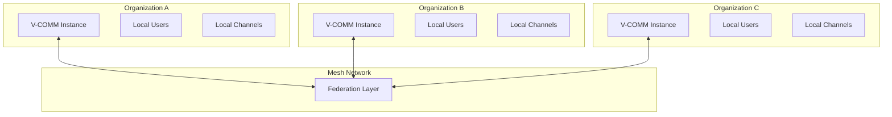
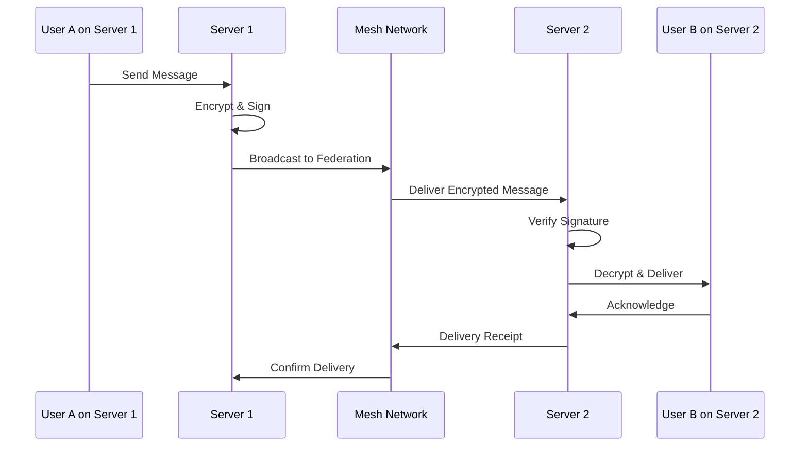

# Mesh (Federation)

## Overview

V-COMM Mesh enables federated, decentralized communication between independent V-COMM instances. This allows organizations to maintain their own servers while communicating securely with other organizations.

## Architecture



## Federation Protocol

### Server Discovery

```typescript
interface FederationServer {
  id: string;
  name: string;
  domain: string;
  publicKey: string;
  endpoints: {
    api: string;
    websocket: string;
    federation: string;
  };
  capabilities: string[];
  version: string;
}

async function discoverServer(domain: string): Promise<FederationServer> {
  // Query well-known endpoint
  const response = await fetch(`https://${domain}/.well-known/vcomm-server`);
  
  const serverInfo = await response.json();
  
  // Verify server signature
  const verified = await verifyServerSignature(serverInfo);
  
  if (!verified) {
    throw new Error('Server signature verification failed');
  }
  
  return serverInfo;
}
```

### Server Authentication

```typescript
interface FederationHandshake {
  serverId: string;
  timestamp: number;
  nonce: string;
  signature: string;
  algorithms: string[];
}

async function performHandshake(
  localServer: ServerInfo,
  remoteServer: FederationServer
): Promise<FederationConnection> {
  // 1. Generate challenge
  const challenge = {
    serverId: localServer.id,
    timestamp: Date.now(),
    nonce: generateNonce(),
    algorithms: ['Dilithium3', 'Ed25519']
  };
  
  // 2. Sign challenge
  challenge.signature = await signChallenge(challenge, localServer.privateKey);
  
  // 3. Send to remote server
  const response = await fetch(`${remoteServer.endpoints.federation}/handshake`, {
    method: 'POST',
    body: JSON.stringify(challenge)
  });
  
  // 4. Verify remote challenge
  const remoteChallenge = await response.json();
  const verified = await verifyServerSignature(
    remoteChallenge,
    remoteServer.publicKey
  );
  
  if (!verified) {
    throw new Error('Remote server verification failed');
  }
  
  // 5. Establish connection
  return {
    remoteServer,
    sessionKey: await deriveSessionKey(challenge, remoteChallenge),
    expiresAt: Date.now() + 3600000  // 1 hour
  };
}
```

## Federation Channels

### Cross-Server Channels

```typescript
interface FederatedChannel {
  id: string;
  name: string;
  type: 'federated';
  
  // Participants
  localMembers: Set<string>;
  remoteMembers: Map<string, Set<string>>;  // serverId -> userIds
  
  // Server info
  hostServer: string;  // Server that hosts the channel
  participatingServers: Set<string>;
  
  // Settings
  settings: {
    allowRemoteRead: boolean;
    allowRemoteWrite: boolean;
    allowRemoteReactions: boolean;
    messageRetention: number;
  };
}

async function createFederatedChannel(
  name: string,
  servers: string[]
): Promise<FederatedChannel> {
  // Create local channel
  const channel = await localCreateChannel(name, 'federated');
  
  // Invite remote servers
  for (const serverId of servers) {
    await inviteToFederation(channel.id, serverId);
  }
  
  return channel;
}
```

### Federation Message Flow



## Message Federation

### Sending Federated Messages

```typescript
interface FederatedMessage {
  id: string;
  channelId: string;
  sender: {
    userId: string;
    serverId: string;
    displayName: string;
    avatarUrl?: string;
  };
  content: EncryptedContent;
  timestamp: number;
  signature: string;
  hash: string;
}

async function sendFederatedMessage(
  channelId: string,
  content: string
): Promise<FederatedMessage> {
  // 1. Get channel federation info
  const channel = await getChannel(channelId);
  const federation = await getFederationInfo(channel.federationId);
  
  // 2. Prepare message
  const message: FederatedMessage = {
    id: generateMessageId(),
    channelId,
    sender: {
      userId: currentUser.id,
      serverId: localServer.id,
      displayName: currentUser.displayName
    },
    content: {},
    timestamp: Date.now(),
    signature: '',
    hash: ''
  };
  
  // 3. Encrypt for each server
  for (const serverId of federation.servers) {
    const serverKey = await getServerKey(serverId);
    message.content[serverId] = await encryptForServer(content, serverKey);
  }
  
  // 4. Sign message
  message.signature = await signMessage(message, localServer.privateKey);
  message.hash = await hashMessage(message);
  
  // 5. Broadcast to federation
  await broadcastToMesh(message);
  
  return message;
}
```

### Receiving Federated Messages

```typescript
async function handleFederatedMessage(
  message: FederatedMessage
): Promise<void> {
  // 1. Verify server signature
  const senderServer = await getServer(message.sender.serverId);
  const verified = await verifySignature(
    message,
    message.signature,
    senderServer.publicKey
  );
  
  if (!verified) {
    throw new Error('Invalid message signature');
  }
  
  // 2. Check message hash
  const computedHash = await hashMessage(message);
  if (computedHash !== message.hash) {
    throw new Error('Message hash mismatch');
  }
  
  // 3. Decrypt content
  const content = await decryptContent(
    message.content[localServer.id],
    localServer.privateKey
  );
  
  // 4. Deliver to local members
  await deliverToLocalUsers(message.channelId, {
    ...message,
    content
  });
  
  // 5. Send delivery receipt
  await sendReceipt(message.id, 'delivered');
}
```

## Federation Governance

### Trust Levels

```typescript
enum FederationTrustLevel {
  // No trust - messages require verification
  NONE = 'none',
  
  // Basic trust - messages accepted from known servers
  BASIC = 'basic',
  
  // High trust - shared user directory, cross-signing
  HIGH = 'high',
  
  // Full trust - shared admin, unified policies
  FULL = 'full'
}

interface FederationAgreement {
  localServer: string;
  remoteServer: string;
  trustLevel: FederationTrustLevel;
  
  // Allowed operations
  permissions: {
    createChannels: boolean;
    sendMessages: boolean;
    shareUsers: boolean;
    shareFiles: boolean;
    searchUsers: boolean;
  };
  
  // Content policies
  contentPolicy: {
    allowedContent: string[];
    blockedContent: string[];
    moderationLevel: 'none' | 'basic' | 'strict';
  };
  
  // Duration
  validFrom: Date;
  validUntil: Date;
  
  // Signatures
  localSignature: string;
  remoteSignature: string;
}
```

### Moderation

```typescript
interface FederationModeration {
  // Report handling
  reportContent: {
    localReport: boolean;   // Report to local admins
    remoteReport: boolean;  // Forward to remote admins
  };
  
  // Content filtering
  contentFilter: {
    enabled: boolean;
    rules: ContentFilterRule[];
  };
  
  // User actions
  userActions: {
    allowRemoteBans: boolean;
    allowRemoteMutes: boolean;
    notifyLocalAdmins: boolean;
  };
}

async function handleRemoteModeration(
  action: ModerationAction
): Promise<void> {
  // Verify action comes from trusted server
  const trustLevel = await getTrustLevel(action.serverId);
  
  if (trustLevel < FederationTrustLevel.BASIC) {
    throw new Error('Server not trusted for moderation');
  }
  
  // Apply action locally
  switch (action.type) {
    case 'ban':
      if (action.affectsLocalUser) {
        await applyRemoteBan(action);
      }
      break;
    case 'content_removal':
      await removeContent(action.contentId);
      break;
  }
}
```

## Federation Discovery

### User Discovery

```typescript
interface FederatedUser {
  id: string;
  serverId: string;
  displayName: string;
  avatarUrl?: string;
  status: 'online' | 'offline' | 'away';
  publicInfo: {
    title?: string;
    organization?: string;
    bio?: string;
  };
}

async function searchFederatedUsers(
  query: string,
  options: SearchOptions
): Promise<FederatedUser[]> {
  const results: FederatedUser[] = [];
  
  // Search local users first
  results.push(...await searchLocalUsers(query));
  
  // Search trusted servers
  for (const server of trustedServers) {
    if (server.allowUserSearch) {
      const remoteResults = await searchRemoteUsers(server, query);
      results.push(...remoteResults);
    }
  }
  
  return results;
}
```

### Channel Discovery

```typescript
async function discoverFederatedChannels(
  serverId: string
): Promise<FederatedChannel[]> {
  const server = await getServer(serverId);
  
  const response = await fetch(
    `${server.endpoints.federation}/channels/public`,
    {
      headers: {
        'Authorization': `Bearer ${await getFederationToken(serverId)}`
      }
    }
  );
  
  return response.json();
}
```

## Security

### End-to-End Encryption

```typescript
interface FederationEncryption {
  // Server-to-server encryption
  serverEncryption: {
    algorithm: 'TLS1.3' | 'QUIC';
    mutualTLS: true;
    certificatePinning: true;
  };
  
  // Message encryption
  messageEncryption: {
    algorithm: 'Signal-Protocol';
    perfectForwardSecrecy: true;
    postQuantum: 'hybrid';  // Kyber + X25519
  };
  
  // Key management
  keyManagement: {
    rotation: '30d';
    distribution: 'on-demand';
    revocation: 'immediate';
  };
}
```

### Audit Logging

```typescript
interface FederationAuditLog {
  timestamp: Date;
  eventType: FederationEventType;
  sourceServer: string;
  targetServer: string;
  action: string;
  details: Record<string, any>;
  outcome: 'success' | 'failure';
}

enum FederationEventType {
  SERVER_CONNECT = 'server_connect',
  SERVER_DISCONNECT = 'server_disconnect',
  MESSAGE_RECEIVED = 'message_received',
  MESSAGE_SENT = 'message_sent',
  USER_JOINED = 'user_joined',
  USER_LEFT = 'user_left',
  MODERATION_ACTION = 'moderation_action'
}
```

## Best Practices

### Federation Setup

1. **Start small**: Begin with one or two trusted partners
2. **Define policies**: Create clear federation agreements
3. **Monitor activity**: Review federation logs regularly
4. **Test thoroughly**: Verify encryption and signatures

### Security Recommendations

1. **Verify all messages**: Never skip signature verification
2. **Rotate keys regularly**: Follow key rotation schedule
3. **Monitor for abuse**: Watch for spam and malicious content
4. **Maintain trust levels**: Review and update trust periodically

## See Also

- [Spaces](./spaces)
- [Security Overview](../security/overview)
- [Cryptography](../architecture/cryptography)
- [API Reference](../api/index)