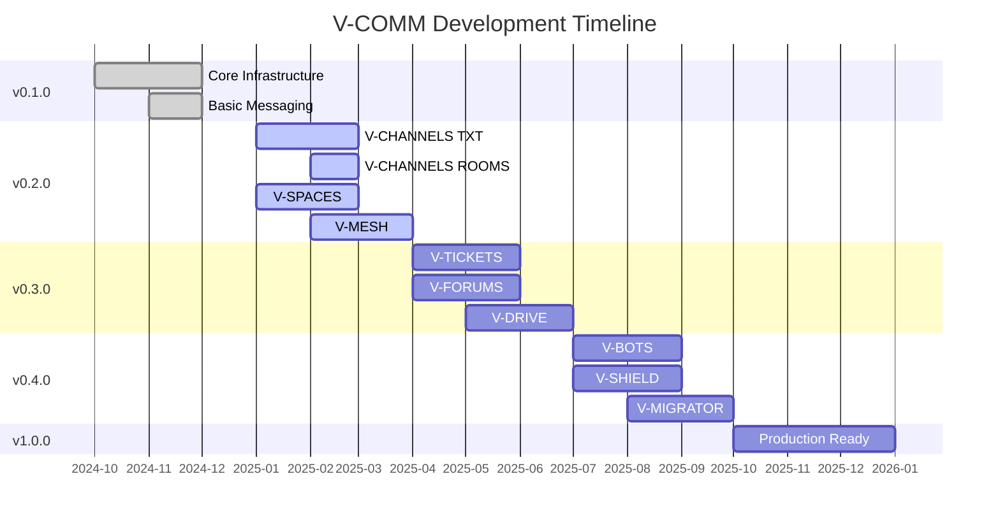

# V-COMM Roadmap

This document outlines the planned development path for V-COMM.

## Vision

V-COMM aims to become the world's most secure, privacy-focused communication platform while maintaining excellent usability and performance.

## Release Schedule

| Version | Target Date | Status | Major Features |
|---------|-------------|--------|----------------|
| 0.1.0 | Q1 2025 | ✅ Released | Core infrastructure, basic messaging |
| 0.2.0 | Q2 2025 | 🚧 In Progress | V-CHANNELS, V-SPACES, V-MESH |
| 0.3.0 | Q3 2025 | 📅 Planned | V-TICKETS, V-FORUMS, V-DRIVE |
| 0.4.0 | Q4 2025 | 📅 Planned | V-BOTS, V-SHIELD, V-MIGRATOR |
| 1.0.0 | Q1 2026 | 📅 Planned | Full feature set, production ready |

## Current Release: v0.2.0

**Status**: In Development  
**Target**: Q2 2025

### Features in Progress

#### V-CHANNELS
- [x] TXT channels (basic text messaging)
- [ ] ROOMS (voice/video rooms)
- [ ] FEEDBACK channels
- [ ] Channel moderation tools
- [ ] Channel permissions

#### V-SPACES
- [ ] Space creation and management
- [ ] Member roles and permissions
- [ ] Space discovery
- [ ] Space invitations

#### V-MESH
- [x] Basic mesh networking
- [ ] Store-and-forward messaging
- [ ] Automatic route discovery
- [ ] Offline indicator

## Upcoming Release: v0.3.0

**Target**: Q3 2025

### Planned Features

#### V-TICKETS (Whistleblower System)
- [ ] Anonymous ticket creation
- [ ] Secure file attachments
- [ ] End-to-end encryption
- [ ] Duress mode integration
- [ ] Ticket lifecycle management

#### V-FORUMS
- [ ] Discussion forums
- [ ] Cryptographic validation
- [ ] Reputation system
- [ ] Voting mechanisms

#### V-DRIVE (P2P Storage)
- [ ] File encryption and upload
- [ ] IPFS integration
- [ ] Peer discovery
- [ ] File sharing
- [ ] Access controls

## Future Release: v0.4.0

**Target**: Q4 2025

### Planned Features

#### V-BOTS (AI Agents)
- [ ] Bot SDK
- [ ] WASM sandbox
- [ ] Bot marketplace
- [ ] Bot permissions

#### V-SHIELD (Anti-Deepfake)
- [ ] Media analysis
- [ ] Deepfake detection
- [ ] Biometric verification
- [ ] User trust scores

#### V-MIGRATOR
- [ ] Discord migration
- [ ] Slack migration
- [ ] Telegram migration
- [ ] Bulk migration tools

## Long-term Goals (v1.0.0+)

### Enhanced Features
- Multi-device synchronization
- Message search
- Scheduled messages
- Message reactions
- Pinned messages
- Message threads

### Platform Improvements
- Mobile apps (iOS, Android)
- Desktop apps (Windows, macOS, Linux)
- Progressive Web App (PWA)
- Browser extensions
- CLI tools

### Integrations
- V-IDENTITY (Steam, PSN, GitHub)
- V-ECONOMY (payment gateway)
- V-ANNOUNCE (cross-guild announcements)
- Calendar integration
- Task management

### Enterprise Features
- SSO/SAML integration
- Audit logs
- Data export tools
- Custom branding
- SLA monitoring
- Dedicated support

## Timeline Visualization

## Metrics & Goals

### User Growth Targets
- Q2 2025: 1,000 active users
- Q3 2025: 5,000 active users
- Q4 2025: 10,000 active users
- Q1 2026: 50,000 active users

### Performance Goals
- Message latency: < 100ms
- Video call quality: 4K @ 60fps
- File upload: 100+ MB/s
- API response: < 50ms
- Uptime: 99.99%

### Security Goals
- Zero critical vulnerabilities
- < 24h vulnerability response
- Regular security audits
- Bug bounty program expansion
- SOC 2 Type II certification

## Feature Request Process

We prioritize features based on:

1. **User demand**: Most requested features get priority
2. **Security impact**: Security improvements are prioritized
3. **Technical feasibility**: Must be achievable with our resources
4. **Strategic value**: Aligns with V-COMM's vision
5. **Community contributions**: Features with contributors move faster

### Request a Feature

Use our [Feature Request Template](https://github.com/vantisCorp/VChat/issues/new?template=feature_request.yml).

---

This roadmap is subject to change based on user feedback, technical challenges, and strategic priorities.