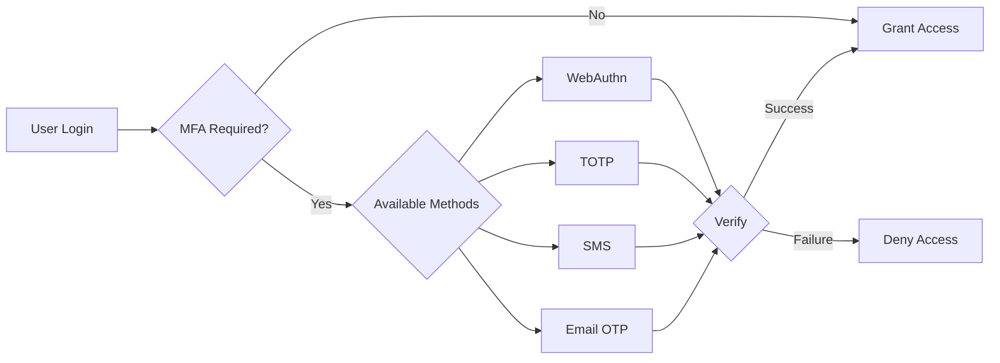

# Authentication System

## Overview

V-COMM implements a comprehensive authentication system that supports multiple authentication methods, multi-factor authentication (MFA), single sign-on (SSO) integration, and secure session management.

## Authentication Methods

### Primary Authentication

| Method | Use Case | Security Level | User Experience |
|--------|----------|----------------|-----------------|
| Email/Password | Default | Medium | Simple |
| Passkey (WebAuthn) | Passwordless | High | Seamless |
| SSO (SAML/OIDC) | Enterprise | High | Integrated |
| Magic Link | Passwordless | Medium | Email-based |
| One-Time Password | Apps/Bots | High | API-based |

### Password Authentication

```typescript
interface PasswordConfig {
  minLength: number;
  maxLength: number;
  requireUppercase: boolean;
  requireLowercase: boolean;
  requireNumbers: boolean;
  requireSymbols: boolean;
  maxAge: number;  // Days until password expires
  historyCount: number;  // Number of previous passwords to check
}

const passwordPolicy: PasswordConfig = {
  minLength: 12,
  maxLength: 128,
  requireUppercase: true,
  requireLowercase: true,
  requireNumbers: true,
  requireSymbols: true,
  maxAge: 90,
  historyCount: 10
};

async function hashPassword(password: string): Promise<string> {
  // Use Argon2id for password hashing
  const salt = crypto.getRandomValues(new Uint8Array(16));
  
  const hash = await argon2id({
    password,
    salt,
    parallelism: 4,
    memorySize: 65536,  // 64 MB
    iterations: 3,
    hashLength: 32
  });
  
  return `argon2id$${base64Encode(salt)}$${base64Encode(hash)}`;
}

async function verifyPassword(
  password: string,
  storedHash: string
): Promise<boolean> {
  const [, saltB64, hashB64] = storedHash.split('$');
  const salt = base64Decode(saltB64);
  const expectedHash = base64Decode(hashB64);
  
  const computedHash = await argon2id({
    password,
    salt,
    parallelism: 4,
    memorySize: 65536,
    iterations: 3,
    hashLength: 32
  });
  
  return constantTimeEqual(computedHash, expectedHash);
}
```

### WebAuthn/Passkey Authentication

```typescript
interface WebAuthnConfig {
  rpName: string;
  rpId: string;
  challengeLength: number;
  timeout: number;
  attestation: 'direct' | 'indirect' | 'none';
}

async function startWebAuthnRegistration(
  userId: string,
  username: string
): Promise<PublicKeyCredentialCreationOptions> {
  const challenge = crypto.getRandomValues(new Uint8Array(32));
  
  return {
    challenge,
    rp: {
      name: config.rpName,
      id: config.rpId
    },
    user: {
      id: new TextEncoder().encode(userId),
      name: username,
      displayName: username
    },
    pubKeyCredParams: [
      { type: 'public-key', alg: -7 },   // ES256
      { type: 'public-key', alg: -257 }, // RS256
      { type: 'public-key', alg: -8 }    // EdDSA
    ],
    authenticatorSelection: {
      authenticatorAttachment: 'platform',
      userVerification: 'required',
      residentKey: 'required'
    },
    timeout: config.timeout,
    attestation: config.attestation
  };
}

async function completeWebAuthnRegistration(
  credential: PublicKeyCredential,
  expectedChallenge: Uint8Array
): Promise<WebAuthnCredential> {
  // Verify challenge
  if (!constantTimeEqual(credential.response.clientDataJSON.challenge, expectedChallenge)) {
    throw new Error('Invalid challenge');
  }
  
  // Verify origin
  const clientData = JSON.parse(new TextDecoder().decode(credential.response.clientDataJSON));
  if (clientData.origin !== config.expectedOrigin) {
    throw new Error('Invalid origin');
  }
  
  // Store credential
  return {
    id: credential.id,
    publicKey: credential.response.attestationObject,
    signCount: credential.response.authenticatorData.signCount,
    transports: credential.response.getTransports?.() || [],
    aaguid: credential.response.authenticatorData.aaguid
  };
}
```

## Multi-Factor Authentication (MFA)

### MFA Methods



### TOTP Implementation

```typescript
interface TOTPConfig {
  digits: number;
  period: number;  // seconds
  algorithm: 'SHA-1' | 'SHA-256' | 'SHA-512';
  window: number;  // periods to check before/after
}

const totpConfig: TOTPConfig = {
  digits: 6,
  period: 30,
  algorithm: 'SHA-256',
  window: 1
};

async function generateTOTPSecret(
  userId: string,
  issuer: string = 'V-COMM'
): Promise<{ secret: string; uri: string; qrCode: string }> {
  // Generate random secret
  const secret = base32Encode(crypto.getRandomValues(new Uint8Array(20)));
  
  // Create otpauth URI
  const uri = `otpauth://totp/${issuer}:${userId}?secret=${secret}&issuer=${issuer}&algorithm=${totpConfig.algorithm}&digits=${totpConfig.digits}&period=${totpConfig.period}`;
  
  // Generate QR code
  const qrCode = await generateQRCode(uri);
  
  return { secret, uri, qrCode };
}

async function verifyTOTP(
  token: string,
  secret: string
): Promise<boolean> {
  const secretBytes = base32Decode(secret);
  const counter = Math.floor(Date.now() / 1000 / totpConfig.period);
  
  // Check current and adjacent windows
  for (let i = -totpConfig.window; i <= totpConfig.window; i++) {
    const expectedToken = await generateTOTPValue(
      secretBytes,
      counter + i,
      totpConfig
    );
    
    if (constantTimeEqual(token, expectedToken)) {
      return true;
    }
  }
  
  return false;
}
```

### Step-Up Authentication

```typescript
interface StepUpConfig {
  sensitiveActions: string[];
  maxAge: number;  // seconds since last auth
  requireMFA: boolean;
}

const stepUpConfig: StepUpConfig = {
  sensitiveActions: [
    'delete_account',
    'change_password',
    'export_data',
    'manage_billing',
    'add_admin'
  ],
  maxAge: 300,  // 5 minutes
  requireMFA: true
};

async function checkStepUpAuth(
  userId: string,
  action: string,
  session: Session
): Promise<{ required: boolean; reason: string }> {
  // Check if action requires step-up
  if (!stepUpConfig.sensitiveActions.includes(action)) {
    return { required: false, reason: 'action_not_sensitive' };
  }
  
  // Check time since last authentication
  const timeSinceAuth = Date.now() - session.lastAuthenticated.getTime();
  if (timeSinceAuth > stepUpConfig.maxAge * 1000) {
    return { required: true, reason: 'auth_expired' };
  }
  
  // Check MFA requirement
  if (stepUpConfig.requireMFA && !session.mfaVerified) {
    return { required: true, reason: 'mfa_required' };
  }
  
  return { required: false, reason: 'auth_valid' };
}
```

## Single Sign-On (SSO)

### SAML Integration

```typescript
interface SAMLConfig {
  entryPoint: string;
  issuer: string;
  callbackUrl: string;
  cert: string;
  signatureAlgorithm: 'rsa-sha256' | 'rsa-sha512';
  wantAssertionsSigned: boolean;
}

class SAMLAuthProvider {
  constructor(private config: SAMLConfig) {}
  
  async initiateLogin(state: string): Promise<string> {
    const samlRequest = this.generateSAMLRequest();
    const redirectUrl = `${this.config.entryPoint}?SAMLRequest=${encodeURIComponent(samlRequest)}&RelayState=${encodeURIComponent(state)}`;
    
    return redirectUrl;
  }
  
  async handleCallback(
    samlResponse: string,
    relayState: string
  ): Promise<SAMLAssertion> {
    // Decode and parse SAML response
    const decoded = base64Decode(samlResponse);
    const assertion = await this.parseAndValidateSAML(decoded);
    
    // Verify signature
    if (this.config.wantAssertionsSigned) {
      await this.verifyAssertionSignature(assertion);
    }
    
    // Extract user attributes
    return {
      nameId: assertion.nameId,
      email: assertion.attributes.email,
      firstName: assertion.attributes.firstName,
      lastName: assertion.attributes.lastName,
      groups: assertion.attributes.groups || []
    };
  }
}
```

### OIDC Integration

```typescript
interface OIDCConfig {
  issuer: string;
  clientId: string;
  clientSecret: string;
  redirectUri: string;
  scope: string[];
}

class OIDCAuthProvider {
  constructor(private config: OIDCConfig) {}
  
  async getAuthorizationUrl(state: string, nonce: string): Promise<string> {
    const params = new URLSearchParams({
      client_id: this.config.clientId,
      redirect_uri: this.config.redirectUri,
      response_type: 'code',
      scope: this.config.scope.join(' '),
      state,
      nonce
    });
    
    return `${this.config.issuer}/authorize?${params}`;
  }
  
  async exchangeCodeForTokens(code: string): Promise<TokenResponse> {
    const response = await fetch(`${this.config.issuer}/token`, {
      method: 'POST',
      headers: { 'Content-Type': 'application/x-www-form-urlencoded' },
      body: new URLSearchParams({
        grant_type: 'authorization_code',
        code,
        redirect_uri: this.config.redirectUri,
        client_id: this.config.clientId,
        client_secret: this.config.clientSecret
      })
    });
    
    return response.json();
  }
  
  async getUserInfo(accessToken: string): Promise<UserInfo> {
    const response = await fetch(`${this.config.issuer}/userinfo`, {
      headers: { Authorization: `Bearer ${accessToken}` }
    });
    
    return response.json();
  }
}
```

## Session Management

### Session Structure

```typescript
interface Session {
  id: string;
  userId: string;
  deviceId: string;
  createdAt: Date;
  lastAccessedAt: Date;
  expiresAt: Date;
  ipAddress: string;
  userAgent: string;
  mfaVerified: boolean;
  lastAuthenticated: Date;
  flags: {
    rememberMe: boolean;
    impersonatedBy?: string;
  };
}

class SessionManager {
  private store: Redis;
  private config: SessionConfig;
  
  async createSession(
    userId: string,
    deviceInfo: DeviceInfo,
    options: SessionOptions = {}
  ): Promise<{ session: Session; token: string }> {
    const session: Session = {
      id: generateUUID(),
      userId,
      deviceId: deviceInfo.deviceId || generateUUID(),
      createdAt: new Date(),
      lastAccessedAt: new Date(),
      expiresAt: new Date(Date.now() + this.config.maxAge * 1000),
      ipAddress: deviceInfo.ipAddress,
      userAgent: deviceInfo.userAgent,
      mfaVerified: false,
      lastAuthenticated: new Date(),
      flags: {
        rememberMe: options.rememberMe || false
      }
    };
    
    // Store session
    await this.store.setex(
      `session:${session.id}`,
      this.config.maxAge,
      JSON.stringify(session)
    );
    
    // Add to user's session list
    await this.store.sadd(`user:sessions:${userId}`, session.id);
    
    // Generate token
    const token = await this.generateSessionToken(session);
    
    return { session, token };
  }
  
  async validateSession(token: string): Promise<Session | null> {
    // Decode and verify token
    const payload = await this.verifySessionToken(token);
    if (!payload) return null;
    
    // Get session from store
    const sessionData = await this.store.get(`session:${payload.sessionId}`);
    if (!sessionData) return null;
    
    const session: Session = JSON.parse(sessionData);
    
    // Check expiration
    if (new Date() > session.expiresAt) {
      await this.terminateSession(session.id);
      return null;
    }
    
    // Update last accessed
    session.lastAccessedAt = new Date();
    await this.store.setex(
      `session:${session.id}`,
      this.config.maxAge,
      JSON.stringify(session)
    );
    
    return session;
  }
  
  async terminateSession(sessionId: string): Promise<void> {
    const sessionData = await this.store.get(`session:${sessionId}`);
    if (sessionData) {
      const session: Session = JSON.parse(sessionData);
      await this.store.srem(`user:sessions:${session.userId}`, sessionId);
    }
    
    await this.store.del(`session:${sessionId}`);
  }
  
  async terminateAllSessions(userId: string, except?: string): Promise<void> {
    const sessionIds = await this.store.smembers(`user:sessions:${userId}`);
    
    for (const sessionId of sessionIds) {
      if (sessionId !== except) {
        await this.terminateSession(sessionId);
      }
    }
  }
}
```

### Token Structure

```typescript
interface AccessTokenPayload {
  sub: string;           // User ID
  sid: string;           // Session ID
  iat: number;           // Issued at
  exp: number;           // Expiration
  aud: string;           // Audience
  iss: string;           // Issuer
  scope: string[];       // Permissions
  trust_level: number;   // Trust score
}

interface RefreshTokenPayload {
  sub: string;           // User ID
  sid: string;           // Session ID
  jti: string;           // Token ID (for revocation)
  iat: number;
  exp: number;
  type: 'refresh';
}

async function generateAccessToken(
  session: Session,
  claims: Record<string, any> = {}
): Promise<string> {
  const payload: AccessTokenPayload = {
    sub: session.userId,
    sid: session.id,
    iat: Math.floor(Date.now() / 1000),
    exp: Math.floor(Date.now() / 1000) + 900,  // 15 minutes
    aud: 'vcomm-api',
    iss: 'vcomm-auth',
    scope: await getUserScopes(session.userId),
    trust_level: await calculateTrustLevel(session),
    ...claims
  };
  
  return await signJWT(payload, config.jwtSecret);
}
```

## Device Management

### Device Registration

```typescript
interface Device {
  id: string;
  userId: string;
  name: string;
  type: 'web' | 'mobile' | 'desktop' | 'bot';
  platform: string;
  os: string;
  browser?: string;
  lastSeen: Date;
  ipAddress: string;
  location?: GeoLocation;
  trusted: boolean;
  registeredAt: Date;
}

class DeviceManager {
  async registerDevice(
    userId: string,
    deviceInfo: DeviceInfo
  ): Promise<Device> {
    // Check device limit
    const devices = await this.getUserDevices(userId);
    if (devices.length >= config.maxDevicesPerUser) {
      throw new Error('Device limit reached');
    }
    
    const device: Device = {
      id: generateUUID(),
      userId,
      name: deviceInfo.name || `${deviceInfo.platform} Device`,
      type: deviceInfo.type,
      platform: deviceInfo.platform,
      os: deviceInfo.os,
      browser: deviceInfo.browser,
      lastSeen: new Date(),
      ipAddress: deviceInfo.ipAddress,
      location: await this.getLocationFromIP(deviceInfo.ipAddress),
      trusted: false,
      registeredAt: new Date()
    };
    
    await this.storeDevice(device);
    
    return device;
  }
  
  async trustDevice(
    userId: string,
    deviceId: string
  ): Promise<void> {
    await this.updateDevice(userId, deviceId, { trusted: true });
    
    // Send notification
    await this.sendNotification(userId, {
      type: 'device_trusted',
      deviceId,
      timestamp: new Date()
    });
  }
}
```

## Security Best Practices

### Brute Force Protection

```typescript
class BruteForceProtection {
  private store: Redis;
  
  async checkAndIncrement(
    identifier: string,
    type: 'login' | 'mfa' | 'password_reset'
  ): Promise<{ allowed: boolean; remaining: number; resetIn: number }> {
    const key = `bruteforce:${type}:${identifier}`;
    const windowMs = config.rateLimitWindows[type];
    const maxAttempts = config.maxAttempts[type];
    
    const attempts = await this.store.incr(key);
    
    if (attempts === 1) {
      await this.store.pexpire(key, windowMs);
    }
    
    const ttl = await this.store.pttl(key);
    
    return {
      allowed: attempts <= maxAttempts,
      remaining: Math.max(0, maxAttempts - attempts),
      resetIn: Math.ceil(ttl / 1000)
    };
  }
  
  async reset(identifier: string, type: string): Promise<void> {
    await this.store.del(`bruteforce:${type}:${identifier}`);
  }
}
```

### Account Lockout

```typescript
interface LockoutPolicy {
  maxFailedAttempts: number;
  lockoutDuration: number;  // seconds
  progressiveDelay: boolean;
  maxProgressiveDelay: number;
}

async function handleFailedLogin(
  userId: string,
  ipAddress: string
): Promise<{ locked: boolean; unlockAt?: Date }> {
  const key = `failed_attempts:${userId}`;
  const attempts = await redis.incr(key);
  
  if (attempts === 1) {
    await redis.expire(key, 3600);  // 1 hour window
  }
  
  if (attempts >= lockoutPolicy.maxFailedAttempts) {
    const lockoutSeconds = lockoutPolicy.progressiveDelay
      ? Math.min(
          lockoutPolicy.lockoutDuration * Math.pow(2, attempts - lockoutPolicy.maxFailedAttempts),
          lockoutPolicy.maxProgressiveDelay
        )
      : lockoutPolicy.lockoutDuration;
    
    await redis.setex(`locked:${userId}`, lockoutSeconds, '1');
    
    return {
      locked: true,
      unlockAt: new Date(Date.now() + lockoutSeconds * 1000)
    };
  }
  
  return { locked: false };
}
```

## Audit Logging

All authentication events are logged:

```json
{
  "event_id": "evt_abc123",
  "timestamp": "2024-01-15T10:30:00Z",
  "event_type": "AUTHENTICATION_SUCCESS",
  "actor": {
    "user_id": "usr_xyz789",
    "session_id": "sess_def456",
    "device_id": "dev_ghi012"
  },
  "context": {
    "ip_address": "192.168.1.100",
    "user_agent": "Mozilla/5.0...",
    "location": "New York, US",
    "auth_method": "password+mfa",
    "mfa_method": "totp"
  },
  "outcome": "SUCCESS",
  "risk_score": 15
}
```

## See Also

- [Security Overview](./overview)
- [Post-Quantum Cryptography](./pqc)
- [Zero Trust Architecture](../architecture/zero-trust)
- [API Reference](../api/index)