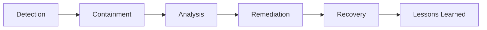

# Security Best Practices

## Overview

This guide provides comprehensive security best practices for developers, administrators, and organizations using V-COMM. Following these guidelines helps ensure the security of your V-COMM deployment and protects your users' data.

## Authentication Security

### Password Policies

Implement strong password policies for your organization:

```yaml
recommendedPasswordPolicy:
  minimum:
    minLength: 12
    maxLength: 128
    requireUppercase: true
    requireLowercase: true
    requireNumbers: true
    requireSymbols: true
    
  advanced:
    checkBreachDatabase: true      # Check against known breaches
    preventCommonPasswords: true   # Block common passwords
    preventUserInfoPatterns: true  # Block passwords containing user info
    
  lifecycle:
    maxAge: 90                     # Days until password expires
    historyCount: 10               # Remember last N passwords
    warningDays: 14                # Warn before expiration
```

### Multi-Factor Authentication

**Recommended MFA Methods (in order of preference):**

1. **WebAuthn/Passkeys** - Highest security, best user experience
2. **TOTP (Authenticator Apps)** - Good security, widely compatible
3. **SMS OTP** - Acceptable backup, vulnerable to SIM swapping
4. **Email OTP** - Backup method only

```typescript
// Recommended MFA configuration
const mfaConfig = {
  // Require MFA for all users
  requireForAllUsers: true,
  
  // Allowed methods (in order of preference)
  allowedMethods: ['webauthn', 'totp', 'sms', 'email'],
  
  // Require MFA for sensitive actions
  stepUpAuth: {
    enabled: true,
    actions: [
      'change_password',
      'export_data',
      'delete_account',
      'add_admin',
      'modify_billing'
    ],
    maxAge: 300  // 5 minutes
  },
  
  // Remember device settings
  rememberDevice: {
    enabled: true,
    duration: 2592000,  // 30 days
    maxDevices: 5
  }
};
```

### Session Security

```typescript
const sessionConfig = {
  // Session duration
  maxAge: 604800,  // 7 days
  
  // Idle timeout
  idleTimeout: 1800,  // 30 minutes
  
  // Absolute timeout (requires re-authentication)
  absoluteTimeout: 259200,  // 3 days
  
  // Concurrent sessions
  maxConcurrentSessions: 5,
  
  // Token configuration
  accessToken: {
    expiresIn: 900,  // 15 minutes
    algorithm: 'RS256'
  },
  refreshToken: {
    expiresIn: 604800,  // 7 days
    rotationEnabled: true,
    reuseDetection: true
  }
};
```

## API Security

### Secure API Key Management

```typescript
// DO: Store API keys securely
import { SecretManager } from '@vcomm/security';

const apiKey = await SecretManager.getSecret('api-key');

// DON'T: Hardcode API keys
const apiKey = 'sk_live_abc123...';  // ❌ Never do this!

// DON'T: Log API keys
console.log(`Using API key: ${apiKey}`);  // ❌ Never do this!
```

### Rate Limiting

Implement appropriate rate limiting:

```yaml
rateLimitConfiguration:
  # General API rate limits
  api:
    authenticated:
      requests: 1000
      window: 60s
    unauthenticated:
      requests: 100
      window: 60s
      
  # Authentication endpoints (stricter)
  auth:
    login:
      requests: 5
      window: 60s
      lockoutAfter: 10
    register:
      requests: 3
      window: 3600s
    passwordReset:
      requests: 3
      window: 3600s
      
  # Message endpoints
  messages:
    send:
      requests: 100
      window: 60s
    read:
      requests: 500
      window: 60s
```

### Input Validation

Always validate and sanitize input:

```typescript
import { z } from 'zod';
import { sanitizeHtml } from '@vcomm/security';

// Define validation schema
const messageSchema = z.object({
  content: z.string()
    .min(1, 'Message cannot be empty')
    .max(4000, 'Message too long'),
  channelId: z.string().uuid('Invalid channel ID'),
  attachments: z.array(z.object({
    type: z.enum(['image', 'video', 'file']),
    url: z.string().url(),
    name: z.string().max(255)
  })).max(10)
});

// Validate input
function validateMessage(input: unknown) {
  const result = messageSchema.safeParse(input);
  
  if (!result.success) {
    throw new ValidationError(result.error);
  }
  
  // Sanitize content
  result.data.content = sanitizeHtml(result.data.content);
  
  return result.data;
}
```

## Data Protection

### Data Classification

Classify data according to sensitivity:

| Classification | Examples | Encryption | Access Control |
|---------------|----------|------------|----------------|
| **Public** | Public channels | Optional | None required |
| **Internal** | Team discussions | Required | Role-based |
| **Confidential** | Private messages | Required | User-specific |
| **Restricted** | Financial, health | Required + E2E | Explicit grant |

### Data Retention

```yaml
dataRetentionPolicy:
  messages:
    default: 365d
    configurable: true
    minimum: 30d
    
  files:
    default: 180d
    maxSize: 100MB
    scanForMalware: true
    
  auditLogs:
    default: 730d  # 2 years
    immutable: true
    
  sessions:
    default: 30d
    cleanupInterval: 1h
    
  deletedData:
    gracePeriod: 30d
    secureDeletion: true
    verification: true
```

### Encryption Configuration

```typescript
const encryptionConfig = {
  // Data at rest
  atRest: {
    algorithm: 'AES-256-GCM',
    keyRotation: '90d',
    keyProvider: 'hashicorp-vault'
  },
  
  // Data in transit
  inTransit: {
    minimumTLS: '1.3',
    cipherSuites: [
      'TLS_AES_256_GCM_SHA384',
      'TLS_CHACHA20_POLY1305_SHA256'
    ],
    certificatePinning: true
  },
  
  // End-to-end encryption
  e2e: {
    enabled: true,
    algorithm: 'Signal-Protocol',
    perfectForwardSecrecy: true,
    postQuantum: 'hybrid'  // Kyber + X25519
  }
};
```

## Infrastructure Security

### Network Hardening

```yaml
networkSecurity:
  # Firewall rules
  firewall:
    defaultDeny: true
    allowedInbound:
      - port: 443
        protocol: HTTPS
        source: any
      - port: 80
        protocol: HTTP
        redirect: HTTPS
    allowedOutbound:
      - port: 443
        protocol: HTTPS
        destination: any
        
  # DDoS protection
  ddos:
    provider: cloudflare
    rateLimit: true
    botProtection: true
    geoBlocking: configurable
    
  # DNS security
  dns:
    dnssec: true
    cnameFlattening: true
    rateLimit: 100rps
```

### Container Security

```yaml
# Kubernetes Pod Security Standards
podSecurity:
  # Run as non-root
  securityContext:
    runAsNonRoot: true
    runAsUser: 1000
    readOnlyRootFilesystem: true
    allowPrivilegeEscalation: false
    capabilities:
      drop: [ALL]
      
  # Resource limits
  resources:
    limits:
      cpu: "1"
      memory: "512Mi"
    requests:
      cpu: "100m"
      memory: "128Mi"
      
  # Network policies
  networkPolicy:
    ingress: []
    egress:
      - to:
          - namespaceSelector:
              matchLabels:
                name: vcomm
```

### Logging and Monitoring

```yaml
securityMonitoring:
  # Log collection
  logging:
    retention: 30d
    destination: elasticsearch
    encryption: true
    
  # Security events to log
  events:
    - authentication_success
    - authentication_failure
    - authorization_failure
    - privilege_escalation
    - data_access
    - configuration_change
    - api_key_usage
    
  # Alerting
  alerts:
    - condition: "authentication_failure > 5 in 5m"
      severity: warning
    - condition: "authentication_failure > 20 in 5m"
      severity: critical
    - condition: "privilege_escalation"
      severity: high
    - condition: "api_key_from_new_location"
      severity: info
```

## Secure Development

### Dependency Management

```yaml
# Security scanning configuration
dependencyScanning:
  # Check for vulnerabilities
  vulnerabilityScan: true
  severityThreshold: moderate
  
  # License compliance
  licenseCheck: true
  allowedLicenses:
    - MIT
    - Apache-2.0
    - BSD-3-Clause
    - ISC
    
  # Update automation
  autoUpdate:
    security: true      # Auto-update for security patches
    minor: false        # Manual review for minor versions
    major: false        # Manual review for major versions
```

### Secure Code Review Checklist

```markdown
## Security Code Review Checklist

### Authentication & Authorization
- [ ] All endpoints require authentication (except public)
- [ ] Authorization checks are present and correct
- [ ] Session validation is performed
- [ ] MFA is enforced for sensitive operations

### Input Handling
- [ ] All user input is validated
- [ ] Input is sanitized before use
- [ ] SQL injection prevention (parameterized queries)
- [ ] XSS prevention (output encoding)
- [ ] CSRF tokens for state-changing operations

### Data Protection
- [ ] Sensitive data is encrypted at rest
- [ ] Data is transmitted over TLS
- [ ] No sensitive data in logs
- [ ] Proper error handling (no stack traces in production)

### API Security
- [ ] Rate limiting is implemented
- [ ] API keys are not hardcoded
- [ ] Proper CORS configuration
- [ ] Versioning is implemented
```

## Incident Response

### Incident Response Plan



### Response Procedures

```yaml
incidentResponse:
  # Severity levels
  severity:
    critical:
      description: "Data breach, system compromise"
      responseTime: 15m  # Initial response
      escalation: immediate
      
    high:
      description: "Security vulnerability being exploited"
      responseTime: 1h
      escalation: 4h
      
    medium:
      description: "Potential vulnerability, policy violation"
      responseTime: 4h
      escalation: 24h
      
    low:
      description: "Minor security issue, improvement"
      responseTime: 24h
      escalation: 72h
      
  # Contact information
  contacts:
    securityTeam: security@vcomm.io
    onCall: +1-xxx-xxx-xxxx
    executive: ciso@vcomm.io
```

### Security Incident Notification

When a security incident occurs, V-COMM will:

1. **Assess** the impact and scope within 4 hours
2. **Notify** affected customers within 24 hours (or as required by law)
3. **Provide** regular updates every 24 hours during active incidents
4. **Publish** post-incident report within 30 days

## Compliance Checklist

### Monthly Tasks

- [ ] Review user access and permissions
- [ ] Check for stale accounts
- [ ] Review security alerts
- [ ] Update password policies if needed
- [ ] Review MFA adoption rates

### Quarterly Tasks

- [ ] Conduct security awareness training
- [ ] Review and update security policies
- [ ] Perform access reviews
- [ ] Update incident response procedures
- [ ] Review vendor security posture

### Annual Tasks

- [ ] Conduct penetration testing
- [ ] Review and update disaster recovery plan
- [ ] Complete compliance audits
- [ ] Review data retention policies
- [ ] Update security awareness training content

## Security Resources

### Internal Resources

- Security Training Portal
- Security Policies Wiki
- Incident Response Playbooks
- Architecture Decision Records

### External Resources

- [OWASP Top 10](https://owasp.org/Top10/)
- [NIST Cybersecurity Framework](https://www.nist.gov/cyberframework)
- [CIS Controls](https://www.cisecurity.org/controls)
- [SANS Security Awareness](https://www.sans.org/security-awareness-training/)

## Contact

For security-related questions or to report a vulnerability:

- **Security Team**: security@vcomm.io
- **Bug Bounty**: https://hackerone.com/vcomm
- **PGP Key**: https://vcomm.io/security.txt

## See Also

- [Security Overview](./overview)
- [Authentication Guide](./authentication)
- [Compliance](./compliance)
- [Cryptography Implementation](../architecture/cryptography)