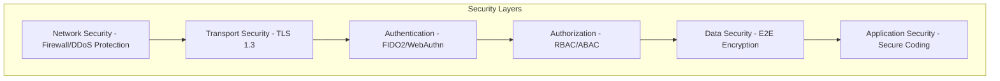

# Security Overview

V-COMM is built with security as a fundamental principle. This document provides an overview of our security architecture.

## Security Principles

### Zero Trust Architecture

V-COMM implements Zero Trust Architecture where:

1. **Never Trust, Always Verify**: Every request is authenticated and authorized
2. **Least Privilege Access**: Users and services have minimal required permissions
3. **Micro-segmentation**: Network is divided into secure zones
4. **Continuous Monitoring**: All actions are logged and analyzed
5. **Assume Breach**: Security is designed assuming the network is compromised

### Defense in Depth

Multiple layers of security protect V-COMM:



### Security by Design

- Threat modeling during design phase
- Security requirements in specifications
- Secure coding guidelines
- Regular security reviews

## Cryptographic Implementation

### Post-Quantum Cryptography

V-COMM uses NIST-standardized Post-Quantum Cryptography:

| Algorithm | Purpose | Security Level |
|-----------|---------|----------------|
| **Kyber1024** | Key Encapsulation | 256-bit |
| **Dilithium5** | Digital Signatures | 256-bit |
| **SPHINCS+** | Hash-based Signatures | 256-bit |

### Classical Cryptography

| Algorithm | Purpose | Use Case |
|-----------|---------|----------|
| **X25519** | Key Exchange | Session keys |
| **Ed25519** | Signatures | Message signing |
| **AES-256-GCM** | Symmetric Encryption | Message encryption |
| **HMAC-SHA256** | Authentication | Message integrity |

### Protocol Layer

| Protocol | Use Case | Features |
|----------|----------|----------|
| **Signal Protocol** | 1:1 Chats | Double Ratchet, X3DH |
| **MLS** | Group Chats | Group encryption |
| **TLS 1.3** | Transport | Forward secrecy |

## Authentication

### FIDO2/WebAuthn

Passwordless authentication using:

- Hardware security keys (YubiKey, Nitrokey)
- Platform authenticators (Touch ID, Windows Hello)
- Mobile authenticators (Android Biometric)

### Multi-Factor Authentication

Additional MFA layers available:

- TOTP (Time-based One-Time Password)
- SMS (fallback for recovery)
- Recovery codes (offline backup)

### Duress PIN

Protection under coercion:

- Triggers data wipe
- Appears to work normally
- Sends distress signal to trusted contacts

## Compliance

### Standards Compliance

| Standard | Status | Scope |
|----------|--------|-------|
| **OWASP ASVS L3** | ✅ Verified | Application Security |
| **FIPS 140-3** | ✅ Validated | Cryptographic Modules |
| **FedRAMP** | ✅ Ready | Government Cloud |
| **HIPAA** | ✅ Compliant | Healthcare Data |
| **GDPR** | ✅ Compliant | EU Privacy |

### Audit & Certification

- Regular third-party security audits
- Penetration testing (annual)
- Bug bounty program
- Continuous security monitoring

## Threat Model

### Threat Categories

| Threat | Mitigation |
|--------|------------|
| Quantum Attacks | Post-Quantum Cryptography |
| MITM Attacks | Certificate pinning, E2E encryption |
| Social Engineering | FIDO2, security training |
| Insider Threats | Zero Trust, audit logging |
| Supply Chain | SBOM, code signing |
| DoS Attacks | Rate limiting, DDoS protection |

### Attack Scenarios

#### Server Compromise

**Attack**: Attacker gains access to server

**Defense**:
- All data is encrypted client-side
- Server only sees encrypted blobs
- No decryption keys on server
- Minimal impact from compromise

#### Quantum Computer Attack

**Attack**: Attacker uses quantum computer to break encryption

**Defense**:
- PQC algorithms (Kyber, Dilithium) are quantum-resistant
- Hybrid encryption with classical and PQC
- Regular key rotation
- Forward secrecy via Double Ratchet

## Bug Bounty Program

We offer rewards for security vulnerabilities:

| Severity | Reward |
|----------|--------|
| Critical | $10,000 |
| High | $5,000 |
| Medium | $1,000 |
| Low | $250 |

## Security Features

| Feature | Description | Status |
|---------|-------------|--------|
| **E2E Encryption** | All messages encrypted client-side | ✅ Active |
| **PQC** | Post-Quantum Cryptography | ✅ Active |
| **Zero Trust** | Every request verified | ✅ Active |
| **Duress PIN** | Protection under coercion | ✅ Active |
| **V-SHIELD** | Anti-deepfake | 🚧 In Progress |

## Security Configuration

### TLS Configuration

```nginx
ssl_protocols TLSv1.3 TLSv1.2;
ssl_ciphers 'TLS_AES_256_GCM_SHA384:TLS_CHACHA20_POLY1305_SHA256';
ssl_prefer_server_ciphers off;
```

### Security Headers

```http
X-Content-Type-Options: nosniff
X-Frame-Options: DENY
Strict-Transport-Security: max-age=31536000
Content-Security-Policy: default-src 'self'
```

## Reporting Vulnerabilities

Report security vulnerabilities responsibly:

- **Email**: security@vcomm.app
- **PGP Key**: Available on SECURITY.md
- **Response Time**: Within 24 hours

## Related Topics

- [Post-Quantum Cryptography](./pqc.md)
- [Authentication](./authentication.md)
- [Compliance](./compliance.md)
- [Best Practices](./best-practices.md)